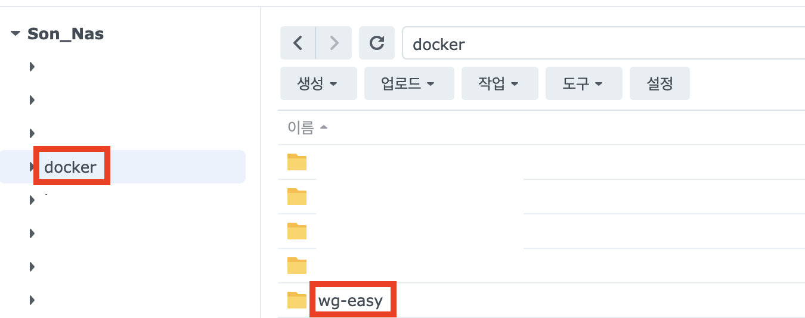

---
## 왜?

나는 보안상의 이유로 홈랩에서 구축한 거의 모든 서비스를 외부로 노출시키지 않고 VPN을 통해 내부망에 연결해서 사용하는 형식으로 사용하고있다. VPN 서버는 많은 서비스들이 실행되고 있는 서버 보다는 상대적으로 안정적인 Synology NAS 서버에 두고있었다. 이에 DSM에서 패키지로 제공하고 있는 OpenVPN이 구축하기 편해서 사용하고 있었으나, 속도를 비롯한 여러가지 측면에서 WireGuard가 더 좋겠다는 생각이 들었고 VPN 서버를 WireGuard로 교체하게 되었다.

**비교**

| 항목                    | **OpenVPN**                              | **WireGuard**                                |
| ----------------------- | ---------------------------------------- | -------------------------------------------- |
| **프로토콜**            | SSL/TLS 기반 (복잡한 암호화)             | 단순한 UDP 기반                              |
| **처리 속도**           | 느림 (CPU 부하 높음)                     | 매우 빠름 (커널 레벨 동작)                   |
| **지연 시간 (Latency)** | 상대적으로 높음                          | 낮음                                         |
| **암호화 효율**         | 낮음 (다양한 알고리즘 지원하지만 무거움) | 높음 (ChaCha20 등 최신 경량 암호화)          |
| **CPU 사용량**          | 높음                                     | 매우 낮음                                    |
| **성능 일관성**         | 환경에 따라 편차 큼                      | 안정적, 고속 유지                            |
| **실제 체감 속도**      | 약 50~100 Mbps                           | 300~700 Mbps 이상 (같은 조건에서 3~5배 빠름) |

---

## WireGuard 설치

### SPK 패키지 빌드하기

DSM에서는 WireGuard를 공식적으로는 지원하지 않는다. 이에 본인의 DSM버전과 NAS장비의 cpu에 맞는 Package Architecture를 확인하고 이에 맞는 빌드를 해야한다.


우선 아래 링크에서 본인의 Synology NAS 장비의 cpu Package Architecture를 확인해야한다.

- https://kb.synology.com/en-global/DSM/tutorial/What_kind_of_CPU_does_my_NAS_have
- 나는 DS224+를 사용하고 있고 이 장비의 Package Arch는 위 링크에서 확인해보면 `Geminilake` 임을 알 수 있다.

SPK 패키지를 빌드하기 위해서는 빌드 환경 도커 컨테이너 내부에서 빌드를 진행해야한다. 도커가 설치되어있는 환경이라면 빌드를 하는 환경은 상관이 없다. 나는 NAS 서버에 ssh로 연결해서 진행하였다.

빌드 환경 도커 이미지: https://hub.docker.com/r/blackvoidclub/synobuild72

- cf) 본인 DSM이 7.1 버전이라면 `synobuild72` -> `synobuild71`

```bash
sudo docker run --rm --privileged --env PACKAGE_ARCH=geminilake --env DSM_VER=7.2 -v /volume1/spk:/result_spk blackvoidclub/synobuild72
```

빌드를 할 환경에 접속하였고, 도커 이미지도 다운로드 받았다면 위 명령어를 입력해준다.

- `PACKAGE_ARCH`: 위에서 확인했던 본인 NAS 장비 CPU의 Package Architecture (소문자로 입력)
- `DSM_VER`: DSM 버전
- `/volume1/spk`: 도커 내부 볼륨과 연결된 외부 볼륨이다. 내부에서 빌드한 결과물이 저장될 볼륨이다. 나는 spk라는 공유 폴더를 NAS에 만들어서 진행했다.


몇 분 기다리면 위 처럼 빌드를 완료했다는 메시지가 뜨고 빌드 산출물이 생긴다.


### 설치하기


- DSM에서 패키지 센터 > 수동 설치


- 찾아보기를 누르고 아까 빌드된 산출물 spk 파일 선택 > 다음
  - debug버전 말고 기본 버전


- 시놀로지에서 확인된 spk가 아니라 우리가 방금 빌드한 spk파일이기 때문에 뜨는 경고이다. 그냥 동의 누르면 된다.


- 여기서 '설치 후 실행하십시오' 옵션을 "체크 해제" > 완료
  - 그냥 실행하면 오류가 나기 때문에 이렇게 진행

```bash
/var/packages/WireGuard/scripts/start
```

- 위 명령어를 NAS에 ssh로 접속한 뒤 입력해주자.


- 이후 확인해보면 잘 실행되고 있는 것을 볼 수 있다.

---

## wg-easy 설치

wg-easy는 WireGuard를 아주 쉽게 관리할 수 있게 해주는 툴이다. 원래는 연결을 할 때 키를 생성해서 연결하고자하는 기기에 옮겨주어야하는데, QR코드 등으로 매우 쉽게 연결할 수 있게 해준다. 또한 연결된 클라이언트의 상태도 쉽게 볼 수 있다.



- DSM의 docker 공유폴더에 `wg-easy`라는 폴더를 만들어준다.


- DSM 컨테이너 매니저 > 프로젝트 > 생성


- 프로젝트 이름: 임의로 하고싶은 이름 설정
- 경로: `/docker/wg-easy`
- 원본: `docker-compose.yml 만들기`
  - 아래 yml코드 입력
- 다음 클릭

```yml
version: "3.8"
services:
  wg-easy:
    environment:
      # ⚠️ Required:
      # Change this to your host's public address
      - WG_HOST=도메인 or 공인ip

      # Optional:
      - PASSWORD=pw #gui web패스워드
      - WG_PORT=51820
      - WG_DEFAULT_ADDRESS=10.8.0.x
      - WG_DEFAULT_DNS=1.1.1.1
      # - WG_MTU=1420
      - WG_ALLOWED_IPS=0.0.0.0/0 #VPN을 태울 IP리스트
      # - WG_PRE_UP=echo "Pre Up" > /etc/wireguard/pre-up.txt
      # - WG_POST_UP=echo "Post Up" > /etc/wireguard/post-up.txt
      # - WG_PRE_DOWN=echo "Pre Down" > /etc/wireguard/pre-down.txt
      # - WG_POST_DOWN=echo "Post Down" > /etc/wireguard/post-down.txt
      
    image: weejewel/wg-easy
    container_name: wg-easy
    volumes:
      - .:/etc/wireguard
    ports:
      - "51820:51820/udp"
      - "51821:51821/tcp"
    restart: unless-stopped
    cap_add:
      - NET_ADMIN
      - SYS_MODULE
    sysctls:
      - net.ipv4.ip_forward=1
      - net.ipv4.conf.all.src_valid_mark=1
```

- `WG_HOST`, `PASSWORD` 변경하기
- 나머지 필요한 옵션 변경하기
- 내부망 DNS 서버를 사용할 경우 `WG_DEFAULT_DNS`를 바꿔주면 된다.


- 웹 포털은 사용할거면 체크하고 다음
- 모든 설치가 완료될 때 까지 기다리자.

---

## 연결

### 포트포워딩

| 구분              | 외부 포트 | 내부 포트 | 내부 IP         | 프로토콜 (Protocol) |
| ----------------- | --------- | --------- | --------------- | ------------------- |
| **WireGuard VPN** | 51820     | 51820     | Synology NAS IP | UDP                 |

- 외부에서 VPN 연결을 하기 위해서 포트포워딩을 해줘야한다.

### 연결


- 내부망에서 http://NAS의IP:51821/ 로 접속하면 위 화면이 뜬다.
- wg-easy를 설치할 때 작성했던 docker-compose.yml 파일에 `PASSWORD`로 작성했던 비밀번호 입력하고 접속한다.
- 참고로, 이 페이지는 외부에서 접속을 할 일도 없으며, 열어놓으면 보안상 좋지 않기 때문에 포트포워딩을 하지 않는 것이다.


- New로 새로운 Client를 만든다.
- 만든 Client는 QR코드, conf 파일 다운로드 2가지 방법으로 편하게 연결이 가능하다.
- 추가적으로 연결 상태를 편하게 확인할 수 있다.

---

## 참고자료

- https://svrforum.com/nas/777419
