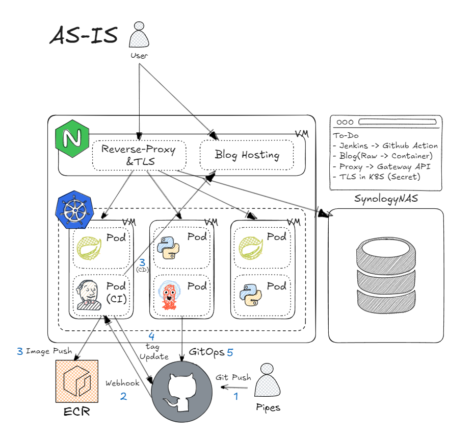
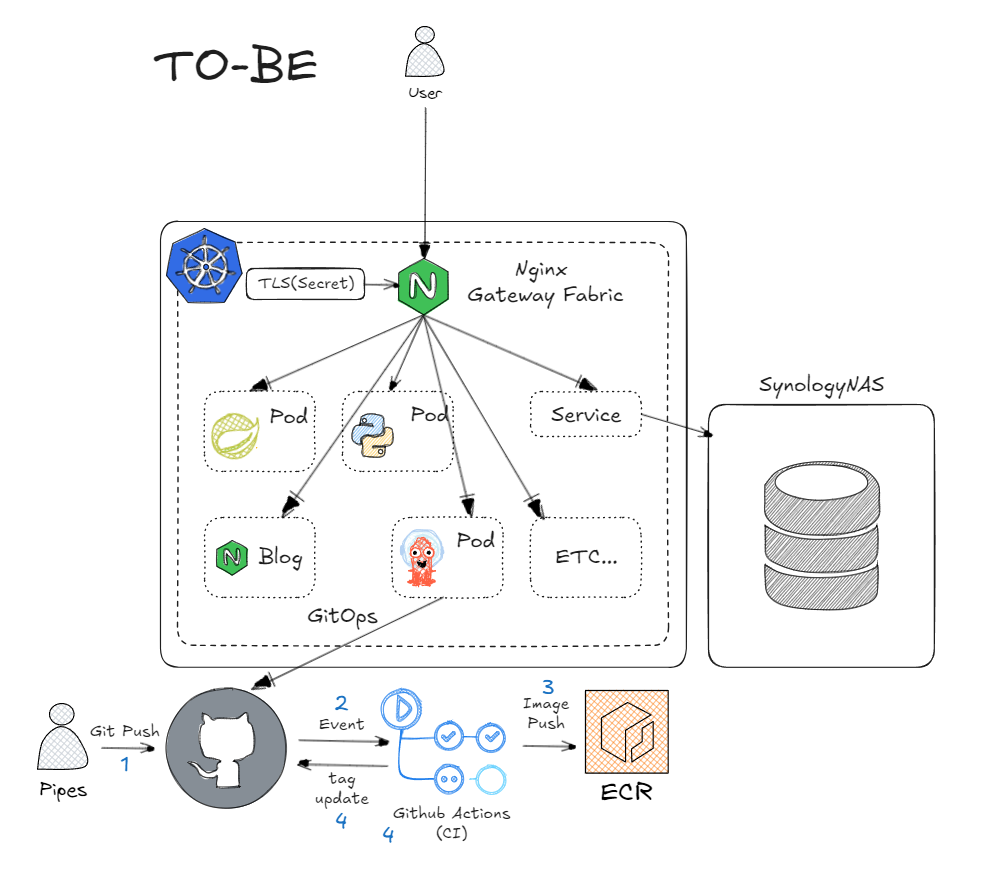

---
## 리팩토링 아키텍처
### AS-IS

### TO-BE

---
## 리팩토링 계기
### 리소스 절약

- 외부 Nginx VM -> Kubernetes Gateway API 
	- 기존에는 쿠버네티스 클러스터 내부의 애플리케이션들, TLS 인증, 블로그 호스팅 등의 여러가지 역할을 하는 Nginx VM(쿠버네티스 클러스터 외부)을 따로 뒀다.
	- VM을 하나 더 실행해야하므로 추가적인 물리적 자원을 소모한다. (크게 무겁지 않긴 하지만)
	- 인력 자원 측면에서는 클러스터 내부에서는 NodePort로 외부에 노출하고 Nginx에서는 리버스 프록시로 해당 포트들로 포워드 해줘야한다.
	- 즉, 트래픽 관리 지점이 2개이므로 관리할 서비스가 많아질수록 관리가 복잡해진다.
	- 이에 이러한 기능들을 해줄 수 있으며 트래픽 관리 지점을 일원화해줄 수 있는 Gateway API를 도입하고, 블로그 또한 컨테이너 형식으로 호스팅하는식으로 리팩토링하기로 결정했다.
- Jenkins -> Github Action
	- 기존에는 쿠버네티스 클러스터 내부에서 Helm으로 Jenkins를 배포하고 설정 파일은 NFS로 동적 프로비저닝한 볼륨을 마운트해서 사용했다.
	- CI/CD 흐름은 깃헙에 푸시 이벤트가 생길 경우 Jenkins로 웹훅을 보낸다 그리고 Jenkins에서는 빌드 후 배포(블로그), 컨테이너 이미지 빌드 후 푸시(애플리케이션) 작업을 한다. (컨테이너의 경우 추가적으로 깃헙 레포지토리 매니페스트에 버전 태그 업데이트도 진행한다)
	- Jenkins 자체를 호스팅하는 자원, 파이프라인 가동 중 하드웨어에 가해지는 부하, Jenkins 자체의 설정 비효율 등의 여러 단점이 있다. (물리적, 인적 자원)
	- Github Action의 경우 자체적으로 호스팅할 자원이 없어도 되며 관리적 측면에서도 훨씬 수월하다.

- 현업에서도 직접 모니터링 시스템을 구축할 수 있지만 DataDog와 같은 SaaS를 사용하는 이유는 "직접 구축, 운영 했을 때의 리스크, 인건비" vs "SaaS 사용했을 때의 비용" 을 비교하여 후자가 더 비용이 적다면 선택하는 것이다.

:::tip
- 이러한 의사 결정은 실제 현업에서 비일비재하게 일어난다. 대표적으로 Kubernetes 오픈소스 대신 Openshift를 사용하는 경우(문제 발생시 대응 및 리스크 감소를 위한 비용 지불)와 직접 모니터링 시스템을 구축할 수 있지만 DataDog와 같은 SaaS를 사용(직접 구축, 운영 했을 때의 리스크, 인건비 대신 SaaS 사용 비용 지불)이 있다.
:::

### 재현성

- 외부 Nginx VM -> Kubernetes Gateway API 
	- 기존에는 Nginx VM을 다시 구축해야한다고하면, VM 생성 -> Nginx 설치 -> 인증서 발급 -> 모든 설정 복원 이러한 번거로운 절차를 거쳤어야했다.
	- 만약 Gateway API를 사용한다면, 구축할 때 사용한 모든 리소스들을 yaml 파일형태로 Git 레포지토리에 저장해두면 GitOps로 쿠버네티스 클러스터만 구축되어있다면 한번에 재현할 수 잇다.
- Jenkins -> Github Action
	- 기존에는 Jenkins를 다시 구축해야한다고하면, Helm으로 Jenkins 설치(+ 기존 설정 파일 경로 pv 마운트)로 크게 어렵지 않게 가능하지만 Github Action은 파이프라인 yaml이 존재하기만 한다면 이러한 간단한 절차조차 필요없다.

---
## 요약

:::tip
나의 홈랩을 좀 더 '클라우드 네이티브'한 아키텍처로 만들어보자.
:::