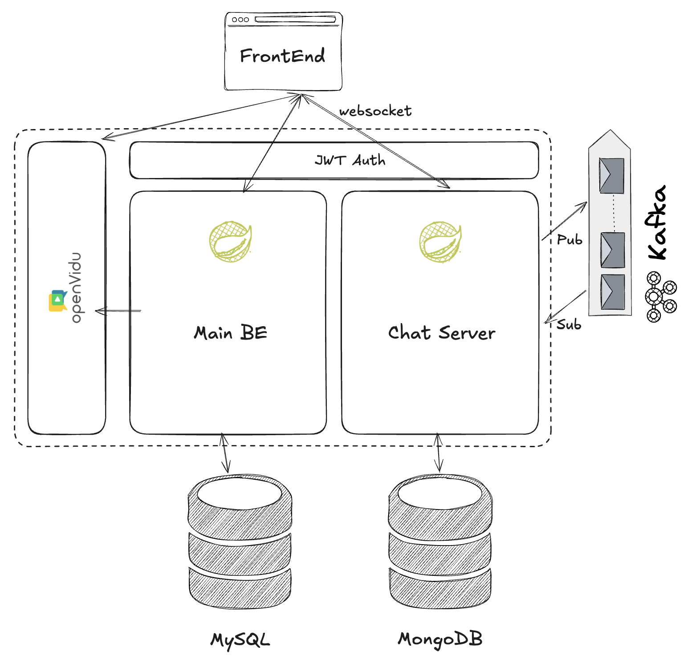

---
## 고도화 계기

개인 프로젝트를 해야겠다는 생각이 있었다.

하지만, 기획부터 A ~ Z를 하는 프로젝트 보다는 내가 예전에 했던 프로젝트들 중 기획이 괜찮았던 것들을 고도화해보고 싶었다.

왜냐하면, 당시의 나 혹은 팀원들이 가지고 있던 지식 내에서 내렸던 의사결정들로 이루어진 프로젝트를 현재 내가 가진 지식, 시각으로 고도화하면서 새로운 고민을 하고 의사결정을 내리며 나의 성장 척도를 확인해보고 싶었기 때문이다.

또한, 새로운 것을 만드는 과정은 기존에 내가 하던 습관을 그대로 답습할 확률이 높다.
기존해 했던 것들에 문제점을 찾으면서 이를 개선하는 과정이 나의 성장에 더 큰 도움이 될 것이라고 생각했다.

---
## 초코레터 프로젝트

### 서비스 개요

2025년 발렌타인데이를 타겟으로 시즈널 서비스로 기획하여 진행한 프로젝트이다. 
(기존 서비스 레포: https://github.com/Son-Hunseo/chocoletter)

간단히 기능을 말하자면, 나의 선물함 링크를 공유하면 해당 링크로 본인의 지인들이 익명으로 편지를 작성해주는 전형적인 익명 편지 서비스였다.
단지 조금 다른점이 있었다면 다음과 같다.

1. "서로" 편지를 주고받았다면 2월 14일(발렌타인데이)에 서로 누구인지 추측하는 익명 채팅방이 열린다.
2. 선물을 보낼 때, "일반 편지"와 "특별 편지"를 보낼 수 있는데, "특별 편지"의 경우 2월 14일 특정 시간을 지정해 상대방에게 "영상통화 초대장"을 보낸다.
	- 상대방이 이 초대장을 수락할 경우 해당 시간에 서로를 확인하는 영상통화방이 열린다.

### 아키텍처

기존 아키텍처는 위 그림과 같다.

1. Main BE
	- 기본적인 기능 (회원 기능, 편지 송수신 기능 등)
	- Openvidu에 영상통화 세션 생성 요청
2. Chat Server
	1. 클라이언트와 웹소켓 연결
	2. Kafka에 채팅방 단위의 topic으로 메시지 publish
	3. Kafka로부터 채팅방 단위의 topic의 메시지 subscribe
	4. subscribe한 메시지 mongodb에 저장
3. Openvidu
	- 생성된 세션으로 영상통화 연결

### To-Be

개선할 내용은 다음과 같다.

1. 쿠버네티스 환경으로 마이그레이션
2. Kafka -> Redis
3. 잘못된 암호화 로직 개선
4. 영상통화 기능 삭제

개선을 하는 이유와 개선 과정은 이후 글로 작성할 예정이다.

---
## 기록

이러한 고도화 과정들을 블로그에 글로써 남기려고한다.

고도화을 해야지라고 마음먹고 프로젝트를 다시 들여다보며 느낀 점 중 하나는 당시에 의사결정들이 희미하게는 기억나지만, 어떠한 의도, 회의 과정을 거쳐서 개발을 했는지에 대한 기록이 남아있지 않아 아쉬웠다.

이에 고도화 과정을 기록하며 몇년 후 성장한 내가 다시 이 과정을 보았을 때 느끼는 점이 있을 것이라 생각하여 기록하게 되었다.