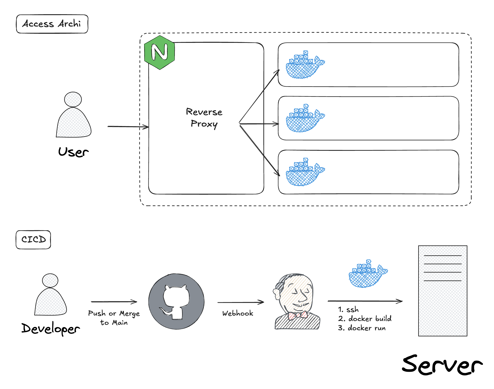

---
## AS-IS

기존의 아키텍처는 각 요소(백엔드 서버, 채팅 서버, 메시지 큐 등)가 단일 컨테이너로 기동되며, 외부에서의 접근은 Nginx가 리버스 프록시 역할을 해주었다.

그리고 CICD 파이프라인의 경우에는 개발자가 git 레포지토리에 push or merge를 하면 해당 레포지토리에서 Jenkins로 웹훅을 보낸다. 그리고 Jenkins가 애플리케이션이 실행되고 있는 서버로 ssh로 접근해서 직접 git clone, docker build, docker run을 하는 구조였다.

이 구조는 다음과 같은 문제점을 가진다.

1. 컨테이너에 문제가 생길 경우 관리자가 서버에 접근해서 다시 컨테이너를 실행시켜줘야한다. (Self-healing)
2. 트래픽이 증가할 경우 수동으로 Scaling 해야한다.
3. 배포 이력 관리가 힘들다.
4. Jenkins에서 ssh 키를 가지고있어 보안적으로 위험성이 존재한다.
5. 롤백이 어렵다.

이에 아래와 같은 구조로 개선하고자 한다.

---
## TO-BE

위와같이 쿠버네티스 기반 아키텍처로 이관하려고한다. 또한 모든 리소스는 yaml 형태의 선언적인 방식으로 git에 기록하고자 한다.

접근 경로는 Gateway API가 외부 로드밸런서를 프로비저닝하고 해당 Gateway API가 각 `Pod`로 가는 `Service`로 `HttpRoute`를 통해 요청을 포워드 할 것이다.

CICD 파이프라인의 경우 개발자가 변경사항을 push or merge를 하면 github action이 이미지를 빌드하고 해당 이미지를 ECR에 푸시한다. 그리고 해당 이미지 태그를 `Deployment`의 이미지 태그에 반영한다. 이 변경사항을 감지한 ArgoCD는 애플리케이션 이미지를 ECR에서 pull 받아 애플리케이션을 업데이트한다.

이 구조는 위의 문제점을 모두 해결한다.

1. 컨테이너에 문제가 생겨도 쿠버네티스가 자동으로 복구한다.
2. 트래픽이 늘어날 경우 HPA로 동적으로 스케일링할 수 있다.
3. 배포 이력은 Github Action, manifest git commit 기록 등으로 관리된다.
4. ssh로 서버에 접속하는 것이 아니라 ArgoCD가 레포지토리 변경사항을 감지하는 구조이므로 보안적으로 개선되었다.
5. 쿠버네티스 환경으로 바뀌었으므로 롤백이 매우 간편하다.

---
## 구현

1. Gateway API의 구현체는 `Nginx gateway fabric`을 사용하였다.
 2. 발렌타인데이 이전 시점과 이후 시점의 프론트엔드, 서버의 환경이 달라지므로 이는 `kustomize`의 overlay에 환경을 2개 (prod/after)로 분리하여 구성하였다.
3. 그리고 인증서 인증과 `AWS Secret Manager`를 사용하기 위해 `cert-manager`와 `external secret` 오퍼레이터를 사용하였다.

모든 구성을 글에 첨부하면 글이 난잡해질 것 같아서 설정은 링크로 첨부한다.

- Gateway
	- https://github.com/Son-Hunseo/my-k8s-base/blob/main/k8s/gateway/gateway.yaml
- Operator
	- https://github.com/Son-Hunseo/my-k8s-base/tree/main/k8s/operator
- Main BE
	- https://github.com/Son-Hunseo/chocoletter-refac/tree/main/chocoletter-server/k8s
- Chat Server (MQ 포함)
	- https://github.com/Son-Hunseo/chocoletter-refac/tree/main/chocoletter-chat/k8s
- Frontend
	- https://github.com/Son-Hunseo/chocoletter-refac/tree/main/chocoletter-client/k8s