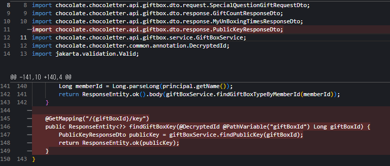

---
## 암호화 기능 수정 이유
### 문제점

당시에 꽂힌 부분은 "이거 개발자들은 편지 내용 다 볼수 있는거 아니에요? 그러면 쓰기 싫은데.." 라는 피드백이다.

이에 "우리도 볼 수 없어야해!"에 매몰되어서 잘못된 암호화 로직을 사용했다. (오히려 더 취약하다)

당시에 사용했던 암호화 로직은 다음과 같다.

- 편지 내용을 복호화하는 키는 대칭키이다.
	- 대칭키는 프론트엔드 코드에서 가지고 있다. (하드코딩)
- 로그인 시점 (로그인 할때마다)
	- 프론트엔드에서 비대칭키를 생성하고 대칭키를 공개키로 암호화해서 서버에 저장한다.
- 편지 전송
	- 대칭키로 편지를 암호화한다. 해당 암호화한 값을 서버로 보내 서버에서는 해당 암호화된 편지 내용을 저장한다.
- 편지 조회
	- 서버에서 (대칭키로)암호화된 편지 내용과 (비대칭키로)암호화된 대칭키를 받는다.
	- 내 개인키로 암호화된 대칭키를 복호화해서 대칭키를 얻는다. (사실 이럴 필요도 없다 프론트엔드에 대칭키가 하드코딩되어있어서)
	- 이 대칭키로 편지 내용을 복호화해서 볼 수 있다.

위 암호화 로직은 완전히 잘못됐다.

결론적으로 아래와 같은 문제점을 가진다.

1. 개발자가 볼 수 있다. (프론트엔드 코드에 대칭키가 하드코딩되어 있음)
2. 브라우저에 박혀있으므로 누구나 암호화된 편지를 복호화할 수 있다.
3. 결과적으로 원하는 목적을 달성하지 못하며 평문으로 보내는 것과 별 다를게 없는 이상한 로직이다.

대칭키를 비대칭키로 암호화해서 키교환(혹은 디피-헬만과 같은 공통키 생성 알고리즘 사용)하는 구조는 많이 사용하는 구조이지만, 이 사례에서 사용하기 적절한 구조는 아니다.

- 왜냐하면, 위와같은 암호화 사용 사례는 SSL 통신과 같은 과정에서 서로 같은 대칭키를 안전하게 교환하여 중간에 탈취자가 데이터를 보지 못하게하는 구조이다.
- 데이터를 교환하는 주체 2명 중 1명이 보지 못하게하는 구조가 아니다. (그렇게 되지도 않고)

마감 하루 전날에 잘 알지 못하는 암호화 로직을 구현하면서 "개발자가 보지 못하는 구조"를 만들려고 억지로 만들다보니 위와같이 이상한 암호화 구조가 만들어진 것이다.

당시에 해당 로직을 구현한 팀원이 잘 모르는 내용을 빠르게 구현하려다보니 AI 도움을 받는 과정에서 이상한 암호화 로직으로 구현하게 된 것 같다. 당시에는 편지 내용을 비대칭키의 공개키로 암호화하고 각 유저마다 브라우저에 가지고 있는 개인키로 복호화하는 로직이라고 들었던 것 같다.

해당 구현을 한 팀원을 탓하는 것은 아니다. 위 논리대로라면 유저의 브라우저 기록만 지워지면 해당 편지 내용은 영원히 복호화할 수 없는데, 이를 그냥 어? 왜 브라우저가 바뀌어도 되지? 라고 의문을 가지면서도 잘 작동하니까 넘어갔던 내 문제도 있다.


### 개선 방향

그래서 어떻게 해야할까?

1. 프론트엔드에서 보낼 때는 평문으로 보낸다.
2. 백엔드에서 대칭키로 암호화해서 DB에 저장한다.
	- 비대칭키는 일반적인 데이터를 암호화하기에 비효율적이다.
3. 해당 대칭키는 안전하게 소수의 인원만 접근할 수 있게 보관한다. (극소수의 인원 접근 가능)

위처럼 관리하는 것이 맞다. 이에 이전의 이상한 암호화 알고리즘은 아예 걷어내는 것이 맞다.

---
## 개선 과정
### 1. 데이터 재암호화

기존 데이터베이스의 편지 내용들을 원래 프론트엔드에 하드코딩되어있던 대칭키로 복호화 후 앞으로 사용할 대칭키로 다시 암호화해서 저장한다. (새롭게 사용할 대칭키는 안전하게 보관되어야하며 소수의 인원들에게만 권한이 있어야한다)
- 지금은 개인 프로젝트이기 때문에 `AWS Secret Manager`에 작성해두고 `External Secret` 오퍼레이터로 생긴 `Secret`이 `Pod` 생성시 동적으로 주입되게 해두었다.
- 하지만, 쿠버네티스 `Secret` 객체도 키를 보관할만큼 안전하지는 않으므로 중요한 데이터를 암호화한 키라면 `AWS KMS`와 같은 매니지드 서비스를 이용하는 것도 좋을 것 같다.

### 2. DB 컬럼 삭제, API 삭제


- Member 테이블에 더이상 공개키를 저장할 필요가 없으므로 Member테이블에 공개키 컬럼을 삭제한다.
- 당연히 이에 따른 엔티티의 필드도 삭제한다.





- 이에 공개키를 저장, 조회하는 API를 삭제한다.
- 당연히 이에 따른 Dto도 삭제한다.


### 3. Util 설정 및 Service 변경

```java
@Slf4j
@Component
public class LetterEncryptionUtil {

    private static final String ALGORITHM = "AES";
    private static final String TRANSFORMATION = "AES/GCM/NoPadding";
    private static final int GCM_TAG_LENGTH = 128;
    private static final int IV_LENGTH = 12;
    private static final SecureRandom SECURE_RANDOM = new SecureRandom();

    @Value("${letter.encrypt-key}")
    private String encryptKeyBase64;

    public String encrypt(String plainText) {
        if (plainText == null || plainText.isEmpty()) {
            return plainText;
        }
        try {
            byte[] keyBytes = Base64.getDecoder().decode(encryptKeyBase64);
            SecretKeySpec secretKeySpec = new SecretKeySpec(keyBytes, ALGORITHM);

            // Generate Random IV(Initialization vector) - 솔트같은 역할
            byte[] iv = new byte[IV_LENGTH];
            SECURE_RANDOM.nextBytes(iv);

            Cipher cipher = Cipher.getInstance(TRANSFORMATION);
            GCMParameterSpec gcmSpec = new GCMParameterSpec(GCM_TAG_LENGTH, iv);
            cipher.init(Cipher.ENCRYPT_MODE, secretKeySpec, gcmSpec);

            byte[] encryptedData = cipher.doFinal(plainText.getBytes(StandardCharsets.UTF_8));

            // IV를 암호화된 값과 결합
            ByteBuffer byteBuffer = ByteBuffer.allocate(IV_LENGTH + encryptedData.length);
            byteBuffer.put(iv);
            byteBuffer.put(encryptedData);

            return Base64.getEncoder().encodeToString(byteBuffer.array());
        } catch (Exception e) {
            log.error("LETTER ENCRYPTION ERROR", e);
            throw new InternalServerException(ErrorMessage.ERR_INTERNAL_SERVER_ENCRYPTION_ERROR);
        }
    }

    public String decrypt(String encryptedText) {
        if (encryptedText == null || encryptedText.isEmpty()) {
            return encryptedText;
        }
        try {
            byte[] keyBytes = Base64.getDecoder().decode(encryptKeyBase64);
            SecretKeySpec secretKeySpec = new SecretKeySpec(keyBytes, ALGORITHM);

            byte[] decodedData = Base64.getDecoder().decode(encryptedText);
            ByteBuffer byteBuffer = ByteBuffer.wrap(decodedData);

            // Extract IV
            byte[] iv = new byte[IV_LENGTH];
            byteBuffer.get(iv);

            // Extract Encrypted Data
            byte[] encryptedBytes = new byte[byteBuffer.remaining()];
            byteBuffer.get(encryptedBytes);

            Cipher cipher = Cipher.getInstance(TRANSFORMATION);
            GCMParameterSpec gcmSpec = new GCMParameterSpec(GCM_TAG_LENGTH, iv);
            cipher.init(Cipher.DECRYPT_MODE, secretKeySpec, gcmSpec);

            byte[] decryptedData = cipher.doFinal(encryptedBytes);
            return new String(decryptedData, StandardCharsets.UTF_8);
        } catch (Exception e) {
            log.error("LETTER DECRYPTION ERROR", e);
            throw new InternalServerException(ErrorMessage.ERR_INTERNAL_SERVER_DECRYPTION_ERROR);
        }
    }
}
```

- 암복호화를 이제 서버에서 수행하기 때문에 사용해야하는 Util을 만들었다.


- 기존에는 프론트에서 암호화된 편지 내용을 전송받기 때문에 그대로 조회, 저장, 수정했지만 이제 프론트에서는 평문으로 보내고 서버에서 암호화 복호화를 수행한다.
- 이에 API의 경우 편지 조회, 생성, 수정에서 컨트롤러단에서는 수정할 부분이 없고 서비스단에서 만든 Util을 사용하는 로직을 추가하면 된다.


