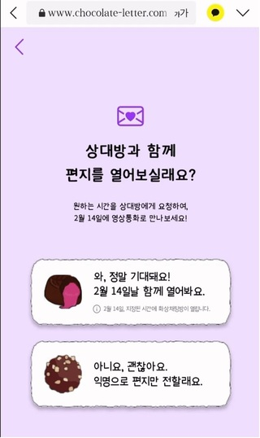
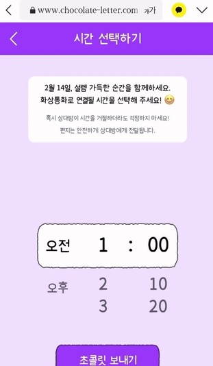
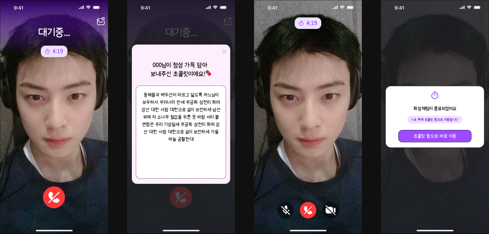
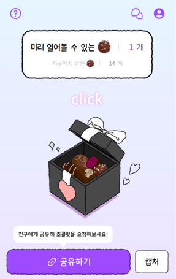

---
## 영상 통화 기능 삭제 이유
### 문제점

당시에 1주일정도 서비스를 운영하는 동안 유저는 약 400명 정도였지만, 결국 영상통화 기능을 제대로 사용한 유저는 10명이 될까말까한 인원이었다.
이 이유를 추측해보면 다음과 같다.

1. 서로 얼굴을 마주하는데에 대한 부담
	- 서로 익명인 상태에서 갑자기 얼굴을 드리미는 영상통화가 허들이 높다는 생각이 든다. (보여 주는 것도, 보는 것도)
2. 알림기능의 미흡함
	- 알림 기능의 경우 당시에 팀에서 많은 고민을하고 만들긴했다.
	- 모바일 환경을 가정한 웹 서비스였는데, 휴대폰에 푸시알림을 주기 위해서는 PWA를 선택해야했다.
	- 하지만 이러한 시즈널 서비스에 유저가 앱까지 다운로드 받는 능동을 기대하기는 힘들다.
	- 이에 유입 편의성 vs 확실한 알림을 저울질하며 고민한 끝에 PWA는 하지 않는 것으로 결정했다.
	- 이 대신 유저가 본인의 영상통화 일정을 확인할 수 있는 일정 탭과 30분 전에 일정을 한번 더 리마인드 할 수 있는 알림 탭을 만들었다. (지금 생각해도 웹에서는 이게 최선이었던 것 같다)

또한, 사용률이 떨어지는 부차적 기능을 위해 소모하는 리소스가 너무 많다.

1. 영상통화 기능을 매개해주기 위한 Openvidu 라는 오픈 소스를 호스팅 해야한다. (인프라적 리소스 낭비)
2. 이 부차적인 영상통화라는 기능을 받쳐주기위한 부가 기능이 너무 많다.
	- 프론트엔드
		- 일정 탭
		- 알림 탭
		- 선물 타입(영상통화 or 일반) 선택 분기
		- 영상 통화 화면
	- 백엔드
		- 영상통화 일정 관리
		- 스케줄링 작업을 일정 시간마다 돌리면서 db 전체를 조회하고 이를 알림
		- 영상 통화 매개

이러한 이유들로 영상 통화 기능을 삭제해야겠다고 생각했다.

---
## 구현

:::info
코드를 넣는건 큰 의미가 없을 것 같아. 삭제 혹은 수정한 화면, 요소, 커밋 기록을 첨부했습니다.
:::

### 프론트엔드

1. **캘린더 기능 삭제**
	- 캘린더 아이콘 삭제
	- 캘린더 모달 삭제
	- 튜토리얼 중 캘린더 부분 삭제
	- 일정 조회 api 호출 로직 삭제
	- 커밋 링크: https://github.com/Son-Hunseo/chocoletter-refac/commit/29ab7902d1bf103891adc4edb32f202d8c9c365e

  

2. **알림 기능 삭제**
	- 알림 아이콘 삭제
	- 수락 거절 모달 삭제
	- 알림 관련 api 호출 로직 삭제
	- 커밋 링크: https://github.com/Son-Hunseo/chocoletter-refac/commit/ee10f2580f540646d5c99b8fe6225ba8eb43a15e

3. **선물 타입 선택 기능 삭제**
	- 일반 선물 버튼 삭제
	- 특별 선물 버튼 삭제
	- 선물 선택 모달 삭제
	- 커밋 링크: https://github.com/Son-Hunseo/chocoletter-refac/commit/0f3cae75ab4aaa40d1204ff4a50aca263b83d442

4. **시간 설정 기능 삭제**
	- 시간 설정 뷰, 버튼 모두 삭제
	- 커밋 링크: https://github.com/Son-Hunseo/chocoletter-refac/commit/ed9c9695273192526125b383545d64fc20a4b294

5. **영상 통화 기능 삭제**
	- 영상통화 대기방 뷰 삭제
	- 영상통화 진행 뷰 삭제
	- 영상통화 연결 종료 뷰 삭제
	- openvidu api 호출 로직 삭제
	- 커밋 링크: https://github.com/Son-Hunseo/chocoletter-refac/commit/c1be402673d5476e26e825d45210da6b12f8d66a

### 백엔드

1. 영상 통화 관련 기능 삭제
	- 영상화 관련 API, 엔티티 모두 삭제
	- 알람을 위한 스케줄링 로직 모두 삭제
	- Openvidu 관련 세션 생성 API 삭제
	- 커밋 링크: https://github.com/Son-Hunseo/chocoletter-refac/commit/399425f2396d31d980f208bd3045fca5fadee2e8

### 메인화면 비교

**전**

**후**

