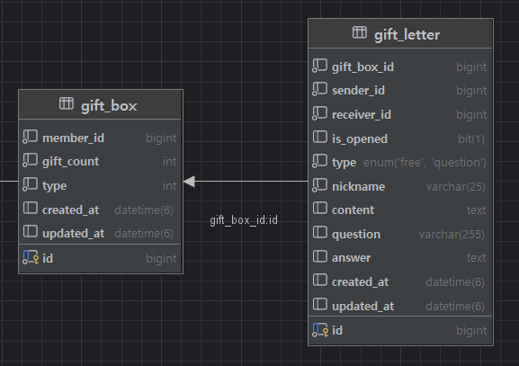

---
## 문제점
### 기존 DB 테이블


기존 테이블 구조는 다음과 같다. 유저가 본인이 받은 편지를 모두 보관하는 단위인 `gift_box` 테이블이 있다. 이와 1:N 관계를 가지는 `gift` 테이블이 있고, 이 `gift`와 1:1관계를 가지는 `letter` 테이블이 있다.

왜 `gift`와 `letter`를 나눠놨느냐? 기획 당시에는 편지뿐만 아니라 본인을 추측할 수 있는 사진을 추가한다거나, 기프티콘을 보낸다던가하는 기획이 있어서 이렇게 구성했다.

그런데 결과적으로 그렇게 되지도 않았고 지금 생각해봐도 간단한 서비스이기 때문에 그렇게 갈 필요가 없다는 생각이 든다.

추가적으로 아래와 같은 성능적 문제도 생긴다.

### 문제점


```java
@Service  
@Slf4j  
@RequiredArgsConstructor  
public class ChatRoomService {
	private final ChatRoomRepository chatRoomRepository;  
	private final GiftRepository giftRepository;  
	private final LetterService letterService;  
	private final IdEncryptionUtil idEncryptionUtil;

	...
	
	public ChatRoomsResponseDto findMyChatRooms(Long memberId) {  
	    List<ChatRoomResponseDto> chatRooms = chatRoomRepository.findMyChatRooms(memberId)  
	            .stream()  
	            .map(chatRoom -> {  
	                Gift guestGift = giftRepository.findGiftByIdOrThrow(chatRoom.getGuestGiftId());  
	                Long receiverId = guestGift.getReceiverId();  
	                String nickname;  
	                if (receiverId.equals(memberId)) {  
	                    nickname = letterService.findNickNameByGiftId(guestGift.getId());  
	                } else {  
	                    nickname = letterService.findNickNameByGiftId(chatRoom.getHostGiftId());  
	                }  
	                return ChatRoomResponseDto.of(idEncryptionUtil.encrypt(chatRoom.getId()), nickname);  
	            })  
	            .collect(Collectors.toList());  
	    return ChatRoomsResponseDto.of(chatRooms);  
	}
	...
	
}
```

위 코드는 유저의 `chat_room` 목록을 조회하는 서비스 로직이다. (채팅방은 편지를 서로 보냈을 경우 생긴다)
위 코드에서 이렇게 테이블을 나눔으로써 발생하는 비효율이 있다.

유저가 가진 채팅방의 갯수가 N개라고 하자.

- 유저가 호스트(`host_id`, 편지 먼저 보냄)인지 게스트(`guest_id`, 편지 늦게보냄)인지 모르기때문에 유저의 `id`가 호스트 혹은 게스트로 박힌 채팅방 모두 조회 (쿼리 1개)
	- (아래 과정 N회 반복)
	- 해당 채팅방에서 본인이 호스트인지 게스트인지 확인
	- 그에 맞는 `gift` 조회 (쿼리 1개)
	- 해당 `gift`에 해당하는 `letter`에서 상대방 닉네임(편지에 적힌 가짜 닉네임) 조회 (쿼리 1개)
- cf) 마지막 채팅 메시지는 채팅서버에서 담당

이래서 해당 로직에서 총 쿼리가 2N+1개가 나간다.

### 해결 방법

`gift`와 `letter`가 분리되어있지 않다면 `gift`에 맞는 `letter`를 찾을 필요가 없기 때문에 이 로직에서의 쿼리는 N+1개가 될 거잇다.

그리고 만약에 `chat_room` 테이블에 호스트와 게스트의 `nickname`(편지에 적힌 가짜 닉네임) 컬럼이 존재한다면 이 로직에서의 쿼리는 1개까지 될 수 있다.

:::tip
그런데, 이미 `letter`에 `nickname`이 적혀있는데 이를 `chat_room`이라는 테이블에 중복으로 적는 것이 맞는 판단일까?

굉장히 잦게 조회되는 로직이라면 효율을 위해 고려해볼 수 있는 선택지이다.

그러나 자주 조회되는 로직도 아닐 뿐더러, 해당 컬럼을 추가하고 동기화하는 과정에 드는 비용이 개선 효과보다 적다고 생각해서 `chat_room` 테이블에 `host_nickname`과 `guest_nickname` 을 추가하는 과정은 진행하지 않을 것이다.

하지만, `gift`와 `letter`를 합치는 작업의 경우에는 분리될 필요 없는 도메인이 나누어져있어, 이 도메인을 사용하는 모든 로직에서 효율과 관리적인 측면에서 모두 비효율이 발생하고 있기 때문에 효용이 크다고 판단하여 진행 할 것이다.
:::

---
## Gift와 Letter를 합치기
### 계획

이 작업의 목표는 `letter`와 `gift`를 합친 `gift_letter`라는 테이블을 새로 만들고 데이터를 이관하고 로직또한 `gift_letter`를 향하게 바꾸는 것이다.

그렇다면 그냥 새로운 테이블을 만들고, 데이터를 이관하고, 로직을 바꾼것을 배포하면 될 것이 아닌가? 라고 생각할 수 도 있다.

그런데 만약 중단되었을 때의 손실이 많아, 서비스가 중단되지않고 이 작업이 진행되어야한다고 생각해보자.

1. DB에서 데이터를 이관(`gift` + `letter` = `gift_letter`) 을 먼저하고, 서버의 로직이 이후에 새로운 테이블(`gift_letter`를 향하게 된 경우)
	- 이 경우 데이터를 이관한 이후에 적용된 변경사항(생성, 삭제, 수정) 등이 새로운 환경에서 반영되지 않는다.
	- ex) 새로운 테이블을 바라보는 로직이 서버에 적용되었을 때 데이터 이관 이후 보낸 편지는 반영되지 않는다.
2. 서버의 로직이 먼저 적용되면 당연히 기존 데이터들이 반영되지 않는 순간들이 존재하기 때문에 문제가 된다.
- cf) 데이터를 이관하는데 시간이 걸리기 때문에 정확히 딱 맞는 순간은 서비스가 중단되지 않고서야 불가능하다.

그렇다면 어떻게 해야할까

1. `gift_letter` 테이블을 만든다.
2. 이중쓰기 로직을 추가한다.
	- ex: `gift`와 `letter`에 어떠한 작업이 들어갈 경우 `gift_letter`에도 동시에 적용되게 한다. (생성, 삭제, 수정 등의 로직 -> `gift` & `giftletter` / `letter` & `gift_letter`)
	- 여기서 주의할 점은 만약 `gift_letter` 에 아직 이관데지 않은 데이터로의 수정, 삭제 요청이 들어올 경우 `gift_letter`에 아직 이관되지 않았으므로 이에 대한 예외처리 필요하다. (없을 경우 insert 한다던가)
3. 이와 동시에 데이터를 이관하는 작업을 한다. (N개씩 끊어서 batch로)
	- 2, 3 과정은 동시에 진행하고 3과정이 끝날경우 다음 과정으로 넘어간다.
	- 이 때 이미 존재하는 데이터라면 `updated_at` 컬럼을 보고 최신화가 필요하다면 적용하고 아니라면 넘어간다.
4. 기존의 이중쓰기 로직을 지우고 로직이 `gift_letter`만 바라보게 바꾼다. 
	- 생성, 삭제, 수정 등의 로직 -> `giftletter`
5. 데이터 정합성을 확인하고 `gift`와 `letter` 테이블을 삭제한다.


### `gift_letter` 테이블 만들기



`gift` 테이블과 `letter` 테이블을 합친 `gift_letter` 테이블을 만들었다.

### 이중쓰기

```java
@Service  
@RequiredArgsConstructor  
public class LetterService {  
    private final LetterRepository letterRepository;  
    private final LetterEncryptionUtil letterEncryptionUtil;  
  
    ...  
  
    @Transactional  
	public void modifyLetter(Long giftId, ModifyLetterRequestDto requestDto) {  
	    Letter letter = letterRepository.findLetterByGiftId(giftId);  
	    // Encrypt content and answer before saving  
	    String encryptedContent = letterEncryptionUtil.encrypt(requestDto.content());  
	    String encryptedAnswer = letterEncryptionUtil.encrypt(requestDto.answer());  
	    letter.modify(requestDto.nickName(), requestDto.question(), encryptedAnswer, encryptedContent);  
	}
}
```

위 메서드는 편지를 수정하는 기존 메서드이다.
당연하게도 `letter`만 수정하고있다.

```java
@Service  
@RequiredArgsConstructor  
public class LetterService {  
    private final LetterRepository letterRepository;  
    private final LetterEncryptionUtil letterEncryptionUtil;  
    private final GiftLetterService giftLetterService;  
  
    ...  
  
    @Transactional  
    public void modifyLetter(Long giftId, ModifyLetterRequestDto requestDto) {  
        Letter letter = letterRepository.findLetterByGiftId(giftId);  
        // Encrypt content and answer before saving  
        String encryptedContent = letterEncryptionUtil.encrypt(requestDto.content());  
        String encryptedAnswer = letterEncryptionUtil.encrypt(requestDto.answer());  
        letter.modify(requestDto.nickName(), requestDto.question(), encryptedAnswer, encryptedContent);  
  
        // 이중 쓰기  
        Long senderId = letter.getGift().getSenderId();  
        Long giftBoxId = letter.getGift().getGiftBox().getId();  
        giftLetterService.modifyGiftLetter(senderId, giftBoxId, requestDto);  
    }  
}
```

위 코드는 수정된 이중 쓰기 메서드이다.
`letter` 수정과 함께 `gift_letter`에도 적용하고 있다.

위 작업을 모든 `gift`와 `letter` 에 대한 로직에 적용하였다.

### Spring Batch

```java
@Slf4j  
@Configuration  
@RequiredArgsConstructor  
public class GiftLetterMigrationJobConfig {  
    private final JobRepository jobRepository;  
    private final PlatformTransactionManager transactionManager;  
    private final EntityManagerFactory entityManagerFactory;  
    private final GiftLetterRepository giftLetterRepository;  
  
    ...  
  
    @Bean  
    public JpaPagingItemReader<Letter> letterReader() {  
        return new JpaPagingItemReaderBuilder<Letter>()  
                .name("letterReader")  
                .entityManagerFactory(entityManagerFactory)  
                .queryString("SELECT l FROM Letter l JOIN l.gift g JOIN g.giftBox gb ORDER BY l.id")  
                .pageSize(100)  
                .build();  
    }  
  
    @Bean  
    public ItemProcessor<Letter, GiftLetter> letterToGiftLetterProcessor() {  
        return letter -> {  
            Long senderId = letter.getGift().getSenderId();  
            Long giftBoxId = letter.getGift().getGiftBox().getId();  
  
            // 이미 존재하면 스킵 (null 반환 시 해당 아이템 제외)  
            if (giftLetterRepository.findBySenderIdAndGiftBoxId(senderId, giftBoxId).isPresent()) {  
                log.info("Skipping Letter id: {} (already migrated)", letter.getId());  
                return null;  
            }  
  
            log.info("Processing Letter id: {}", letter.getId());  
  
            if (letter.getType() == LetterType.FREE) {  
                return GiftLetter.createGeneralGiftLetter(  
                        letter.getGift().getGiftBox(),  
                        senderId,  
                        letter.getGift().getReceiverId(),  
                        letter.getNickname(),  
                        letter.getContent()  
                );  
            } else {  
                return GiftLetter.createQuestionGiftLetter(  
                        letter.getGift().getGiftBox(),  
                        senderId,  
                        letter.getGift().getReceiverId(),  
                        letter.getNickname(),  
                        letter.getQuestion(),  
                        letter.getAnswer()  
                );  
            }  
        };  
    }  
  
    @Bean  
    public ItemWriter<GiftLetter> giftLetterWriter() {  
        return giftLetters -> {  
            log.info("Writing {} GiftLetters", giftLetters.size());  
            giftLetterRepository.saveAll(giftLetters);  
        };  
    }  
}
```

위 코드는 원본 데이터를 읽고, 이를 우리가 원하는 `GiftLetter` 객체로 변환하고 이를 다시 저장하는 배치 작업 설정 코드이다.

```java
@Slf4j  
@RestController  
@RequestMapping("/api/v1/admin/batch")  
@RequiredArgsConstructor  
public class BatchController {  
    private static final Long ADMIN_MEMBER_ID = 24L; // 관리자 ID  
    private final JobLauncher jobLauncher;  
    private final Job giftLetterMigrationJob;  
  
    @PostMapping("/gift-letter-migration")  
    public ResponseEntity<String> runGiftLetterMigration(Principal principal) {  
        Long memberId = Long.parseLong(principal.getName());  
        if (!ADMIN_MEMBER_ID.equals(memberId)) {  
            log.warn("Unauthorized batch access attempt by memberId: {}", memberId);  
            return ResponseEntity.status(403).body("Forbidden");  
        }  
  
        try {  
            JobParameters jobParameters = new JobParametersBuilder()  
                    .addLong("run.id", System.currentTimeMillis())  
                    .toJobParameters();  
  
            jobLauncher.run(giftLetterMigrationJob, jobParameters);  
  
            log.info("GiftLetter migration job started successfully by memberId: {}", memberId);  
            return ResponseEntity.ok("Migration job started successfully");  
        } catch (Exception e) {  
            log.error("Failed to start migration job", e);  
            return ResponseEntity.internalServerError()  
                    .body("Failed to start migration job: " + e.getMessage());  
        }  
    }  
}
```

이를 관리자만 호출할 수 있는 API를 생성하여 실행하였다.

현재 쿠버네티스 기반 멀티 인스턴스 환경이므로 애플리케이션이 실행될 때 자동으로 실행되게한다면, 이 작업이 여러번 수행될 것이기 때문에 이처럼 작동하게 하였다.

### 로직 이동

```java
@Slf4j  
@Service  
@RequiredArgsConstructor  
public class GiftLetterService {  
    private final GiftLetterRepository giftLetterRepository;  
    private final QuestionRepository questionRepository;  
  
    private final GiftBoxRepository giftBoxRepository;  
    private final MemberRepository memberRepository;  
    private final ChatRoomRepository chatRoomRepository;  
  
    private final LetterEncryptionUtil letterEncryptionUtil;  
    private final IdEncryptionUtil idEncryptionUtil;
    
    ...
    
    @Transactional  
	public void modifyGiftLetterById(Long memberId, Long giftLetterId, ModifyGiftLetterRequestDto requestDto) {  
	    GiftLetter giftLetter = giftLetterRepository.findByIdOrThrow(giftLetterId);  
	    if (!memberId.equals(giftLetter.getSenderId())) {  
	        throw new ForbiddenException(ErrorMessage.ERR_FORBIDDEN);  
	    }  
	    String encryptedContent = letterEncryptionUtil.encrypt(requestDto.content());  
	    String encryptedAnswer = letterEncryptionUtil.encrypt(requestDto.answer());  
	    giftLetter.modify(requestDto.nickName(), requestDto.question(), encryptedAnswer, encryptedContent);  
	}
}
```


모든 데이터 이관작업이 끝났을 때, 기존 이중쓰기 로직을 없애고 새로운 테이블인 `gift_letter`로만 향하는 로직을 만든다.

위 코드는 이전에 이중쓰기에서 봤던 편지 수정 로직을 `gift_letter`로만 향하게 바꾼 것이다. 이후 데이터 정합성을 체크하고 일치한다면, `gift`와 `letter`의 모든 로직과 DB 테이블을 삭제하면된다.

아직 남은 문제점이 있다. 위 코드를 보면 `GiftLetterService`에서 다른 도메인 `GiftBoxRepository`, `MemberRepository`, `ChatRoomRepository` 등 다른 도메인의 클래스를 의존하고 있다.

이것까지 이 글에서 다루면 글이 너무 길어지니 다음 글에서 다루도록 한다.