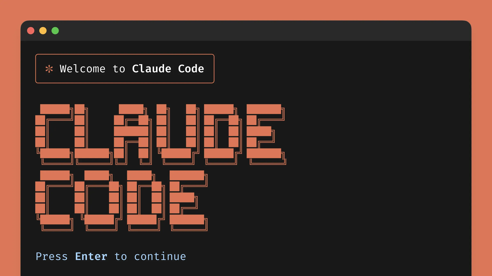

---
date: 2026-03-07
title: Claude Code 사용법
description: Claude Code의 사용법과 주요 기능을 상세히 설명합니다. Normal, Auto-Accept, Plan 모드의 차이점과 권장 워크플로우를 안내하며, CLAUDE.md를 통한 프로젝트 규칙 정의 방법을 다룹니다. 컨텍스트 관리, 프롬프팅 기법, Skills 및 SubAgent 활용법, 그리고 Hooks와 단축키 등 효율적인 개발을 위한 다양한 팁과 모범 사례를 제공합니다.
keywords: [Claude Code, AI 코딩 도구, CLAUDE.md, 프롬프트 엔지니어링, 개발 생산성]
---

---


## Mode와 권장 워크 플로우
### Mode

| 모드 이름                       | 터미널 표시 예시                            | 주요 특징                                                          |
| --------------------------- | ------------------------------------ | -------------------------------------------------------------- |
| Normal Mode (기본 모드)         | 별도 표시 없음 또는 기본 상태로 표시                | 모든 파일 쓰기, 위험 명령 실행 등은 매번 사용자 승인 필요, 기본으로 가장 **안전한** 모드         |
| Auto-Accept Mode (자동 승인 모드) | `⏵⏵ accept edits on` 등이 하단에 보라색으로 표시 | 파일 읽기·쓰기, 간단한 수정은 자동 승인, 쉘 명령이나 위험 작업은 여전히 확인을 요구하는 빠른 작업 모드   |
| Plan Mode (플랜 모드, 읽기 전용)    | `⏸ plan mode on` 표시                  | 코드베이스는 자유롭게 읽고 검색하지만 파일 수정·생성·위험 명령은 모두 차단되는 읽기 전용 분석·계획 전용 모드 |
- 각 모드는 `Shift + tab` 으로 전환

### 권장 워크 플로우 (중요)

1. Explore
	- 코드베이스를 탐색하고 현재 구조를 이해합니다.
	- (Plan Mode) `"read /src/auth and understand how sessions work"`
2. Plan
	- 변경 계획을 수립하고 접근 방식을 결정합니다
	- (Plan Mode) `"I want to add Google OAuth. What files need to change? Create a plan."`
3. Implement
	- Plan Mode를 빠져나와 실제 구현을 시작합니다
	- (Normal Mode) `"implement the OAuth flow. write tests. fix failures."`
4. Commit (나는 개인적으로 이건 수동으로 함)
	- 검증 후 커밋하고 PR을 생성합니다
	- (Normal Mode) `"commit with a descriptive message and open a PR"`

:::tip
내가 이전에 사용하지 않았던 기능
-> `/rewind` 기존에 작성되었던 코드가 사라질까봐 커밋을 하고 시도해보고 아니면 커밋을 없애는 식으로 했었는데 앞으로는 과감하게 시도하고 `/rewind`를 사용하자.
:::

---
## Claude.md
### Claude.md 란?

- 프로젝트의 규칙, 컨벤션, 워크플로우를 정의하는 파일이다.
- Claude Code가 매 세션 시작 시 자동으로 읽어 컨텍스트로 사용한다.
- `/init` 명령으로 프로젝트를 분석하여 초안을 자동 생성할 수 있다.

| 위치                    | 적용 범위        | Git 공유         |
| --------------------- | ------------ | -------------- |
| `~/.claude/CLAUDE.md` | 모든 프로젝트 전역   | —              |
| `./CLAUDE.md`         | 프로젝트 루트      | O (팀 공유)       |
| `./CLAUDE.local.md`   | 프로젝트 개인 설정   | X (.gitignore) |
| `./subdir/CLAUDE.md`  | 해당 디렉토리 작업 시 | O              |

### 작성 팁

:::tip
결국 간결함이 핵심. 안적어도 AI가 알아서 할거같은 정보는 작성하지 않는다. -> 너무 길면 오히려 성능 저하
:::

| ✓ 포함해야 할 것 | ✕ 제외해야 할 것 |
|---|---|
| Claude가 추측할 수 없는 Bash 명령어 | 코드에서 이미 읽을 수 있는 것 |
| 기본값과 다른 코드 스타일 규칙 | Claude가 이미 아는 언어 표준 규칙 |
| 테스트 실행 방법 및 선호 테스트 러너 | 상세 API 문서 (대신 링크 제공) |
| 브랜치 명명, PR 컨벤션 등 팀 에티켓 | 자주 바뀌는 정보 |
| 프로젝트 특유의 아키텍처 결정 사항 | "클린 코드 작성" 같은 자명한 지침 |
| 개발 환경 특이사항 (필수 환경 변수) | 파일별 코드베이스 설명 |
| 흔한 gotcha 및 비직관적 동작 | 장황한 설명이나 튜토리얼 |

**예시**
```markdown
# 코드 스타일
- ES 모듈(import/export) 사용, CommonJS(require) 금지
- 가능하면 구조 분해 할당 사용
- TypeScript strict 모드 사용

# 워크플로우
- 타입 체크: npm run typecheck (코드 변경 후 반드시 실행)
- 전체 테스트 스위트 말고 단일 테스트 실행: npm test -- path/to/test
- 중요: 항상 구현 전에 테스트 먼저 작성

# Git 컨벤션
- 브랜치: feature/[작업명], fix/[이슈번호]
- 커밋: 컨벤셔널 커밋 (feat:, fix:, docs:, refactor:)
- main 브랜치에 강제 푸시 금지

# 주의사항
- auth 미들웨어는 passport가 req.user를 설정해야 동작
- DB 마이그레이션은 반드시 npm run migrate로 실행
```

---
## Context
### 관리 전략

:::tip
`Claude.md`를 불필요하게 길게 작성하는 것이 성능을 저하시키는 것 처럼. Context가 너무 길어지면(하나의 대화 세션이 너무 길어지는) 성능이 저하된다.
-> LLM은 Context(대화 세션)이 너무 길어지면 성능이 저하된다.

LLM 성능은 컨텍스트가 차면서 저하된다. 컨텍스트 윈도우는 당신이 관리해야 할 가장 중요한 리소스다. (Anthropic 공식 Best Practices)
:::

| 명령어                 | 기능           | 사용 시점                           |
| ------------------- | ------------ | ------------------------------- |
| `/clear`            | 컨텍스트 완전 초기화  | 새 작업 전, 성능 저하 시                 |
| `/compact <hint>`   | 지능형 압축       | `/compact Focus on API changes` |
| `/context`          | 토큰 사용량 시각화   | 현재 상태 확인                        |
| `/rewind`           | 체크포인트 복원     | 잘못된 방향 되돌리기                     |
| `claude --continue` | 최근 세션 이어서 시작 | 중단된 작업 재개                       |
| `claude --resume`   | 세션 목록에서 선택   | 특정 세션 복귀                        |
| `/rename`           | 세션에 이름 부여    | 나중에 찾기 쉽게                       |

### cf) HANDOFF.md

:::tip
**Handoff 패턴**
- 아직 해당 작업이 마무리 되지 않았는데 성능 개선을 위한 Context를 초기화하고 싶을 경우 필요한 정보만 넘기는 `HANDOFF.md`를 작성해서 다음 세션에 필요 정보를 이어줄 수 있다.
- 프롬프트: `"Put the rest of the plan in HANDOFF.md. Explain what you tried, what worked, what didn't."`
:::

---
## 프롬프팅 기법
### 검증 수단, 레퍼런스 제공

(Anthropic 공식 문서) 테스트, 스크린샷, expected output 없이 구현을 요청하지 마세요. (이미지는 터미널에 드래그앤 드롭)

| 전략       | ✕ 나쁜 예         | ✓ 좋은 예                                                                   |
| -------- | -------------- | ------------------------------------------------------------------------ |
| 검증 기준 제공 | 이메일 검증 함수 구현해줘 | validateEmail 작성. 테스트: user@example.com=true, invalid=false. 구현 후 테스트 실행 |
| UI 시각 검증 | 대시보드 보기 좋게 만들어 | [스크린샷 첨부] 이 디자인 구현. 결과 스크린샷 찍어서 비교하고 차이점 수정해                             |
| 근본 원인 해결 | 빌드가 실패해        | 빌드 실패 에러: [에러 붙여넣기]. 수정하고 빌드 성공 확인. 증상 억제 말고 근본 원인 수정                    |

### 인터뷰 기법

복잡한 기능을 구현하기 전에 Claude에게 인터뷰를 요청하면, 놓치기 쉬운 엣지 케이스와 트레이드오프를 사전에 발견할 수 있습니다.

```md
"[간략한 설명]을 만들고 싶어.
자세히 인터뷰해줘.
기술 구현 방식, UI/UX,
엣지 케이스, 트레이드오프에 대해 질문해줘.
모든 내용을 다룰 때까지 계속 인터뷰하고,
완성된 스펙을 SPEC.md에 작성해줘."
```

### 구조화된 프롬프팅

역할 정의 + 컨텍스트 + 제약조건 + 예상 출력 + 검증 기준

```md
"당신은 시니어 백엔드 개발자입니다.
 컨텍스트: PostgreSQL 16, Node.js 22, 기존 users 테이블 존재
 요구사항: 사용자 인증 미들웨어 작성
 제약조건: JWT 사용, refresh token 포함, rate limiting 필수
 출력: 코드 + 테스트 + 보안 고려사항
 검증 기준: SQL injection 방어, 401/403 적절한 분리"
```

### @ 참조 활용

필요한 파일만 명시적으로 지정하여 Context 낭비를 줄인다.

```md
@src/auth/        # 디렉토리 참조
@package.json     # 특정 파일 참조
@docs/api.md      # 문서 참조
```

### 파이프 데이터 주입

```md
# 에러 로그 주입
cat error.log | claude

# 특정 출력 분석
npm run build 2>&1 | claude

# diff 리뷰
git diff | claude "이 변경사항을 리뷰해줘"
```

---
## 확장 생태계

| 확장 유형   | 설명                        | 로드 방식           | 최적 용도               |
| ------- | ------------------------- | --------------- | ------------------- |
| Skills  | 마크다운 기반 지식 + 실행 가능 명령     | 슬래시 명령 또는 자동 로드 | 프로젝트별 워크플로우, 코딩 패턴  |
| Plugins | npm 패키지로 배포되는 확장          | 설치 후 자동 활성화     | LSP 통합, 메모리, 브레인스토밍 |
| MCP     | Model Context Protocol 서버 | 설정 파일에 등록       | 외부 도구/API 연동        |

### Skills

**정의 마크다운 파일 위치**
- 프로젝트 단위: `./.claude/skills/my-skill/SKILL.md`
- 유저 단위: `~/.claude/skills/my-skill/SKILL.md`

**예시**
```md
# Skills 예시: .claude/skills/security-review.md
---
name: security-review
description: 종합 보안 리뷰 실행
---

## 단계
1. 하드코딩된 시크릿 스캔: `grep -r "API_KEY\|SECRET\|PASSWORD"`
2. SQL 인젝션 패턴 확인
3. 모든 사용자 입력값 살균 여부 검증
4. 인증 미들웨어 커버리지 확인
5. 결과를 SECURITY_REPORT.md에 출력
```

### Plugin

**설치**
- `/plugin` 명령어로 원하는 플러그인 찾아서 설치/관리 가능

### MCP

**설치**
- Notion MCP 서버 통합 예시 명령어: `claude mcp add --transport http notion https://mcp.notion.com/mcp`
- 참고: https://code.claude.com/docs/ko/mcp

**관리**
- `/mcp` 명령어로 관리 가능

---
## SubAgent

:::warning
`skills`와 `subagent`의 차이
- `skills` = 메인 에이전트의 컨텍스트에 특정 기능을하는 `skill`을 추가합니다. (Main Context 내부에서)
- `subagent` = Main Context를 유지하고 별도의 Context에서 병렬적으로 특정 기능을 수행하기위해 사용됩니다. (별도의 Context에서 작업)
:::

### 정의 방법

**1. 대화형으로 생성**
- `/agents`

**2. 직접 md 파일정의**

예시
```md
# .claude/agents/security-reviewer.md
---
name: security-reviewer
description: 코드 변경 후 보안 취약점 검토. 코드 변경 시 자동 실행.
tools: Read, Grep, Glob, Bash
model: opus
---

당신은 시니어 보안 엔지니어입니다. 다음 항목을 코드 리뷰하세요:
- 인젝션 취약점 (SQL, XSS, 커맨드 인젝션)
- 인증/인가 결함
- 코드 내 시크릿 또는 자격증명 노출
- 안전하지 않은 데이터 처리

특정 라인 번호와 수정 제안을 함께 제공하세요.
```

| 프론트매터 필드              | 설명                                 |
| --------------------- | ---------------------------------- |
| `model`               | haiku / sonnet / opus — 작업 복잡도에 맞게 |
| `tools`               | 허용 툴 제한으로 안전성 확보                   |
| `isolation: worktree` | 격리된 git 워크트리에서 실행                  |
| `memory: project`     | 세션 간 지식 지속                         |
| `background: true`    | 항상 백그라운드 실행                        |

### 기본 내장 SubAgent

| 에이전트            | 모델         | 역할                  | 도구 접근       |
| --------------- | ---------- | ------------------- | ----------- |
| Explore         | Haiku (빠름) | 코드베이스 탐색 전용         | Read-only   |
| Plan            | 상속         | Plan Mode에서 컨텍스트 수집 | Read-only   |
| General-purpose | 상속         | 복합 작업 수행            | Full access |

---
## 병렬 개발

여러 터미널 탭에서 동시에 Claude Code를 실행하여 병렬적으로 작업을 수행하게한다.

충돌을 방지하기위해 주로 브랜치를 나눠서 실행시킨다.

### 방법 예시

```md
# 터미널 탭 3개에서 동시에 독립 기능 개발
Tab 1: claude --worktree feature-auth
Tab 2: claude --worktree feature-db
Tab 3: claude --worktree feature-ui

# 각 에이전트가 독립 브랜치에서 충돌 없이 작업
# 완료 후 PR 생성하여 병합
```

---
## Agent Teams

:::warning
Agent Teams는 실험적 기능으로 기본 비활성화입니다. 세션 재개, 태스크 조율, 종료 동작에 알려진 제한이 있습니다. 같은 파일 편집, 순차적 작업, 의존성이 많은 작업에는 단일 세션이나 서브에이전트가 더 효과적입니다.

-> 나도 개인적으로 아직 이 기능을 신뢰하지 않아서 사용하지 않는다. 나중에 실험적 기능에서 안정적인 기능으로 업데이트가 되면 적극 사용해볼 예정
:::

### 정의

Agent Teams는 여러 Claude Code 인스턴스가 **팀으로 협업**하는 기능입니다. Lead agent가 작업을 조율하고, 팀원들은 독립적으로 작업하며 서로 직접 소통합니다. 서브에이전트와 달리 팀원 간 직접 커뮤니케이션이 가능합니다.

### SubAgent vs Agent Teams

| 비교 항목  | 서브에이전트      | Agent Teams         |
| ------ | ----------- | ------------------- |
| 커뮤니케이션 | 메인에게만 보고    | 팀원 간 직접 소통          |
| 컨텍스트   | 메인 세션 내부    | 각자 독립 컨텍스트 윈도우      |
| 조율     | 메인 에이전트가 제어 | 공유 태스크 리스트로 자율 조율   |
| 토큰 사용  | 적음          | 많음 (병렬 세션)          |
| 최적 용도  | 빠른 포커스 작업   | 리서치, 크로스 레이어, 경쟁 가설 |

### 활성 방법

```md
# Agent Teams 활성화
# ~/.claude/settings.json
{
  "env": {
    "CLAUDE_CODE_EXPERIMENTAL_AGENT_TEAMS": "1"
  }
}

# 팀 생성 예시
"Create an agent team to explore this from different angles:
 one teammate on UX, one on technical architecture,
 one playing devil's advocate."

# 디스플레이 모드 설정
{
  "teammateMode": "in-process"  // 또는 "tmux"
}
```

### 팀 제어 단축키

- `Shift+Down` — 팀원 간 순환 이동
- `Enter` — 팀원 세션 보기
- `Escape` — 팀원 현재 턴 중단
- `Ctrl+T` — 공유 태스크 리스트 토글

---
## Hooks
### 개념

**Hooks**는 Claude Code의 라이프사이클 이벤트에서 자동 실행되는 셸 명령입니다. CLAUDE.md 규칙은 확률적(LLM이 따를 수도, 안 따를 수도)이지만, **Hooks는 결정론적으로 강제**합니다. 린트, 포맷, 보안 스캔, 알림 등을 자동화하세요.

즉, CLAUDE.md는 LLM이 판단하여 특정 조건을 따를수도 따르지 않을 수도 있지만 `Hooks`는 강제한다. (쿠버네티스 스케줄링에서의 [Extension Points](../01-Kubernetes/01-CKA/02-scheduling/11-Scheduler-Profile.md#extension-points)를 떠올려보면 이해가 쉽다)

### 이벤트 발생 시점

|이벤트|트리거 시점|활용 예시|
|---|---|---|
|`PreToolUse`|도구 실행 전|보호 파일 편집 차단, 위험 명령 필터링|
|`PostToolUse`|도구 실행 후|코드 자동 포맷 (Prettier), 린트 실행|
|`Notification`|Claude가 입력 대기|macOS/Linux 네이티브 알림 전송|
|`SessionStart`|세션 시작/재개|컴팩션 후 컨텍스트 재주입|
|`Stop`|Claude 응답 완료|자동 커밋, 품질 체크|
|`ConfigChange`|설정 변경|감사 로그 기록|
|`UserPromptSubmit`|사용자 프롬프트 제출|프롬프트 전처리|

### Handler 유형

|유형|설명|
|---|---|
|`command`|셸 명령 실행 (알림, 포맷, 차단)|
|`prompt`|Claude 모델에 판단 위임 (Yes/No)|
|`agent`|서브에이전트가 파일 읽기/명령 실행 후 판단|
### Exit Code

|코드|의미|
|---|---|
|`0`|성공 — 계속 진행|
|`2`|차단 — 도구 실행 중단|
|기타|오류 — 경고 표시 후 계속|

### 생성 방법

- `/hooks` 명령어 입력 후 이후에 나오는 절차에 따라 정의
- `Hooks` 또한 프로젝트단위(`./.claude/settings.json`) 혹은 유저단위(`~/.claude/settings.json`)으로 설정할 수 있다.

### 예시

아래의 예시 스크립트 혹은 명령어를 `Hooks`로 특정 시점에 실행하는 것을 보장할 수 있다.

```md
# 실전 예시: 보호 파일 편집 차단
# protect-files.sh

#!/bin/bash
INPUT=$(cat)
FILE=$(echo "$INPUT" | jq -r '.tool_input.file_path // empty')
PROTECTED=("package-lock.json" ".env" "docker-compose.yml")
for p in "${PROTECTED[@]}"; do
  if [[ "$FILE" == *"$p"* ]]; then
    echo "BLOCKED: $FILE is protected"
    exit 2  # exit 2 = 차단
  fi
done
exit 0
```

```
# 실전 예시: 편집 후 자동 포맷
# PostToolUse + matcher: "Edit|Write"

npx prettier --write "$TOOL_INPUT_FILE_PATH"
```

```
# 실전 예시: 알림 (macOS)
# Notification 이벤트

osascript -e 'display notification "Claude needs input" with title "Claude Code"'
```

---
## 필수 단축키 & 명령어

| 단축키 / 명령어                        | 설명                                  |
| -------------------------------- | ----------------------------------- |
| `Esc`                            | 작업 중단 (컨텍스트 유지)                     |
| `Esc × 2`                        | 리와인드 메뉴 열기                          |
| `Shift+Tab`                      | 모드 순환 (Normal → Auto-accept → Plan) |
| `Ctrl+G`                         | 플랜을 외부 에디터에서 열기                     |
| `Ctrl+B`                         | 현재 작업 백그라운드로 전환                     |
| `Ctrl+T`                         | Agent Teams 태스크 리스트 토글              |
| `Shift+Down`                     | Agent Teams 팀원 간 순환                 |
| `?`                              | 모든 단축키 표시                           |
| `/clear`                         | 컨텍스트 완전 초기화                         |
| `/compact`                       | 지능형 컨텍스트 압축                         |
| `/context`                       | 토큰 사용량 시각화                          |
| `/rewind`                        | 체크포인트 복원                            |
| `/init`                          | CLAUDE.md 자동 생성                     |
| `/agents`                        | 서브에이전트 관리                           |
| `/permissions`                   | 명령어 화이트리스트 설정                       |
| `/hooks`                         | 훅 설정                                |
| `/config`                        | 설정 UI 열기                            |
| `/usage`                         | 레이트 리밋 확인                           |
| `/stats`                         | 사용 통계 (GitHub 스타일 그래프)              |
| `/chrome`                        | 네이티브 브라우저 통합 토글                     |
| `--continue`                     | 최근 세션 이어서 시작                        |
| `--resume`                       | 세션 목록에서 선택 복귀                       |
| `--dangerously-skip-permissions` | 권한 확인 없이 자유 실행 (컨테이너 내부 권장)         |

---
## 레퍼런스

- https://claudeguide-dv5ktqnq.manus.space/
- 위 문서에서 최신 업데이트 내용이 주기적으로 정리되고 있으며, 위 글에서 작성한 기능 외에도 여러 패턴들이 소개되고 있으므로 필요할 때 마다 참고