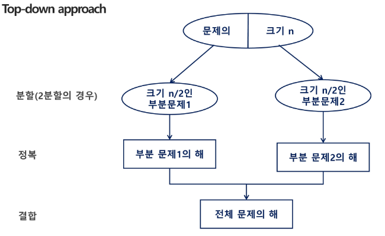
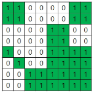
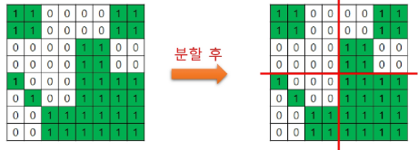

## 분할 정복 기초
### 대표 예제

:::info
**가짜 동전 찾기**
- n개의 동전들 중에 가짜 동전이 하나 포함되어 있다. 가짜 동전은 진짜 동전에 비해 아주 조금 가볍다. 진짜 동전들의 무게가 동일하다고 할 때, 양팔 저울을 이용해서 가짜 동전을 찾아보자.
 - 양팔 저울을 최소로 사용해서 가짜 동전을 찾는 방법은 무엇인가?
- 예를 들어 동전이 24(진짜 23, 가짜 1)개 있다면?
:::

- 풀이 예시 
	1. n = 24 : 절반(12개)씩 나눠서 비교 (가벼운 쪽에 가짜 동전이 있다)
	2. n = 12 : 6개씩 나눠서 비교
	3. (...)
	4. n = 3 : 1, 1, 1로 나눠서 1, 1을 비교
		- 만약 무게가 같다면 비교하지 않은 쪽이 가짜 동전 
		- 무게가 다르다면 가벼운쪽 이 가짜 동전

### 개념

- 설계 전략
	- **분할(Divide)**: 해결할 문제를 여러 개의 작은 부분으로 나눈다.
	- **정복(Conquer)**: 나눈 작은 문제를 각각 해결한다.
	- **통합(Combine)**: (필요하다면) 해결된 해답을 모은다.

- 대표적인 예: 퀵 정렬, 병합 정렬

- Top-down approach



### 예제: 거듭 제곱

- (기존) 반복(Iterative) 알고리즘: O(n)
	- $C^n$ 을 구하고 싶을 때

```plain
Iterative_Power(C, n)
	result <- 1
	
	FOR i in 1 -> n
		result <- result * C
	
	RETURN result
```

- 분할 정복 기반의 알고리즘: O($log_{2}n$)
	- $C^n$ 을 구하고 싶을 때

```plain
Recursive_Power(C, n)
	IF n == 1 : RETURN C
	
	IF n is even
		y <- Recursive_Power(C, n/2)
		RETURN y * y
	ELSE
		y <- Recursive_Power(C, (n-1)/2)
		RETURN y * y * C
```

## 분할 정복 응용
### 예제: 같은 색 공간 만들기



:::info
**같은 색 공간 만들기**
- 여러 개의 작은 단위 정사각형(크기 1) 공간들로 이루어진 커다란 정사각형 모양의 공간이 주어져 있고, 각 단위 정사각형 공간들은 하얀색 또는 초록색으로 칠해져 있다.
 - 주어진 정사각형 공간을 일정한 규칙에 따라 나누어 다양한 크기를 갖는 정사각형 모양의 하얀색 또는 초록색의 공간으로 만들려고 한다.
 - 입력으로 주어진 전체 공간의 한 변의 길이 N과 전체 공간을 구성하는 각 단위 정사각형 공간의 색상 (하얀색 또는 초록색)이 주어질 때 규칙에 따라 나누어진 하얀색 공간과 초록색 공간의 정사각형의 개수를 구하는 프로그램을 작성하시오.
 - 전체 공간의 크기는 N x N (N = 2, 4, 8, 16, 32, 64, 128 중 하나)
:::



- 솔루션
	- 공간이 모두 같은 색으로 칠해져있지 않으면 가로와 세로로 중간 부분을 잘라서 똑같은 크기의 4개의 N/2 x N/2 공간으로 나눈다.
	- 나누어진 4 개의 공간 각각에 대해서도 앞에서와 마찬가지로 모두 같은 색으로 칠해져 있지 않으면 같은 방법으로 똑같은 크기의 4개의 공간으로 나눈다.
	- 이와 같은 과정을 나누어진 공간이 모두 하얀색 또는 초록색으로 칠해져 있거나, 하나의 정사각형 공간이 되어 더 이상 나눌 수 없을 때까지 반복한다.

```java
/*
8
1 1 0 0 0 0 1 1
1 1 0 0 0 0 1 1
0 0 0 0 1 1 0 0
0 0 0 0 1 1 0 0 
1 0 0 0 1 1 1 1
0 1 0 0 1 1 1 1
0 0 1 1 1 1 1 1
0 0 1 1 1 1 1 1
*/

public class DivideSpaceTest {

	static int N, map[][], white, green;

	public static void main(String[] args) {
		
		Scanner sc = new Scanner(System.in);
		
		N = sc.nextInt();
		map = new int[N][N];
		
		for (int i = 0; i < N; i++) {
			for (int j = 0; j < N; j++) {
				map[i][j] = sc.nextInt();
			}
		}
		cut(0, 0, N);
		System.out.println(white);
		System.out.println(green);
	}

	static void cut(int r, int c, int size) {
	
		// 주어진 공간이 모두 같은 색으로 이루어졌는지 체크
		int sum = 0;
		for (int i = r, rEnd = r + size; i < rEnd; i++) {
			for (int j = c, cEnd = c + size; j < cEnd; j++) {
				sum += map[i][j];
			}
		}
		
		// 같은색이며녀 분할하지 않음
		if (sum == 0) {
			white++;
		} else if (sum == size * size) {
			green++;
		} else { // 같은색으로 이루어져 있지 않으면 4분할
			int half = size/2;
			cut(r, c, half);
			cut(r, c+half, half);
			cut(r+half, c, half);
			cut(r+half, c+half, half);
		}
		
	}

}
```

## 이진 탐색
#### 개념

- 대표적인 분할 정복을 활용한 알고리즘이다. (Divide와 Conquer까지만 하고 Combine은 하지 않는다)
- 정렬된 자료의 중앙 값을 목표 값과 비교
	- 중앙 값이 목표 값보다 클 경우 범위를 중앙 값 기준 왼쪽으로 좁힌다.
	- 중앙 값이 목표 값보다 작을 경우 범위를 중앙 값 기준 오른쪽으로 좁힌다.
	- 반복
- 이진 검색을 하기 위해서는 자료가 **정렬된 상태**여야 한다.
- 이진 탐색은 원리를 이해하기는 쉽지만 부등호와 같은 디테일 때문에 **외우는 것이 낫다.**

- **(추천) 반복문 사용 구현**

```plain
binarySearch(S[], n, key)
	start <- 0
	end <- n - 1
	
	WHILE start <= end
		mid <- (start + end) / 2
		
		IF S[mid] == key
			RETURN mid
		ELIF S[mid] < key
			start <- mid + 1
		ELIF S[mid] > key
			end <- mid - 1
	END WHILE
	
	RETURN -1
```

- 재귀 사용 구현

```plain
binarySearch(S[], start, end, key)
	IF start > end
		RETURN -1
	ELSE
		mid <- (start + end) / 2
		
		IF S[mid] == key
			RETURN mid
			
		ELIF S[mid] < key
			RETURN binarySearch(S[], mid + 1, end, key)
		
		ELSE
			RETURN binarySearch(S[], start, mid - 1, key)
```

### 구현 코드
#### 일반 이진 탐색

```java
public class BinarySearchExample {
    // 일반적인 이진 탐색
    public static int binarySearch(int[] arr, int target) {
        int left = 0, right = arr.length - 1;
        
        while (left <= right) {
            int mid = (left + right) / 2;
            
            if (arr[mid] == target) {
                return mid; // 찾은 경우
            } else if (arr[mid] < target) {
                left = mid + 1; // 오른쪽 탐색
            } else {
                right = mid - 1; // 왼쪽 탐색
            }
        }
        
        return -1; // 못 찾은 경우
    }
}
```

#### Lower Bound

```java
public class BinarySearchExample {
    // lower bound: target 이상이 처음 나오는 위치
    public static int lowerBound(int[] arr, int target) {
        // -1 하지 않는 이유는 들어갈 자리를 찾아야하기 때문
        int left = 0, right = arr.length;
        
        while (left < right) {
            int mid = (left + right) / 2;
            
            if (arr[mid] < target) {
                left = mid + 1; // target보다 작은 경우 오른쪽으로
            } else {
	            // 해당 mid가 target일 수 있기 때문에 -1 하지 않는다.
                right = mid; // target 이상이면 왼쪽으로 좁힘
            }
        }
        
        return left; // target 이상이 처음 나오는 인덱스
    }
}

```

#### Upper Bound

```java
public class BinarySearchExample {
    // upper bound: target보다 큰 값이 처음 나오는 위치
    public static int upperBound(int[] arr, int target) {
        int left = 0, right = arr.length;
        
        while (left < right) {
            int mid = (left + right) / 2;
            
            if (arr[mid] <= target) {
                left = mid + 1; // target 이하인 경우 오른쪽으로
            } else {
	            // 해당 mid가 target일 수 있기 때문에 -1 하지 않는다.
                right = mid; // target 초과면 왼쪽으로 좁힘
            }
        }
        
        return left; // target보다 큰 값이 처음 나오는 인덱스
    }
}
```

### `java.util.Arrays.binarySearch`

- `int binarySearch(int[] a, int key)`
- `int binarySearch(int[] a, int fromIndex, int toIndex, int key)`
- 리턴값
	- 탐색성공 - `key가 위치한 index`
	- 탐색실패 - `-삽입할위치-1` 
	- 탐색실패시 저런 리턴값을 주는 이유는 탐색 실패시 삽입 위치가 0일 경우를 구별하기 위함
- https://docs.oracle.com/javase/8/docs/api/java/util/Arrays.html