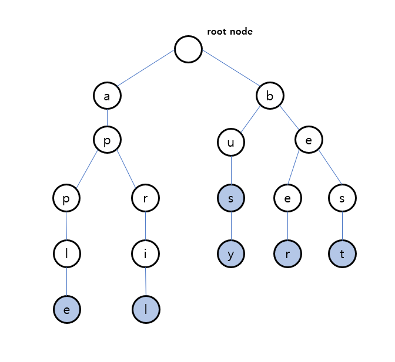

---
## Trie
### Tire(트라이) 란?

Trie는 문자열을 효율적으로 저장하고 검색하기 위한 '트리' 형태의 자료구조이다.
- **메모리를 많이 사용하는 대신, 탐색속도가 매우 빠르다.**
- 주로 자동완성, 사전, IP 라우팅 등에 사용된다.

### Trie의 구조



- 루트 노드는 빈 문자열을 나타내야 하므로 항상 비어있어야한다.
- 각 노드는 문자(`Character`) 1개를 가진다.
- 각 노드는 '현재 노드를 마지막으로 하는 단어가 있는지' 를 나타내는 `isEndOfWord`라는 `boolean` 타입 필드를 가진다. 
	- 위 그림에서 파란색 노드가 `isEndOfWord = true`
	- 즉, 위 그림에서 담고 있는 문자열은 `apple`, `april`, `bus`, `busy`, `beer`, `best` 이다.

### 복잡도

**시간 복잡도**
- 삽입: $O(m)$ - $m$은 문자열 길이
- 검색: $O(m)$
- 삭제: $O(m)$

**공간 복잡도**
- $O(문자의종류 × N × M)$ - N은 문자열 개수, M은 평균 길이
	- 문자의 종류: ex) 알파벳 - 26개

### 장단점

**장점:**
- 문자열 검색이 매우 빠르다.
- 정렬된 순서로 문자열을 순회할 수 있다.

**단점:**
- 메모리 사용량이 많다.

---
## 구현
### 노드 구조

```java
class TrieNode {
    Map<Character, TrieNode> children;
    boolean isEndOfWord;
    
    public TrieNode() {
        children = new HashMap<>();
        isEndOfWord = false;
    }
}
```

### 전체 자료 구조

```java
class Trie { 
	private TrieNode root; 
	
	public Trie() { 
		root = new TrieNode(); 
	}
	
	// 탐색 메서드
	// 삽입 메서드
	// 삭제 메서드
}
```

### 탐색

```java
class Trie {
	...
	public boolean search(String word) { 
		TrieNode current = root; 
		
		for (char ch : word.toCharArray()) { 
			if (!current.children.containsKey(ch)) { 
				return false; 
			} 
			current = current.children.get(ch); 
		} 
		
		return current.isEndOfWord; 
	}	
	...
}
```

### 삽입

```java
class Trie {
	...
	public void insert(String word) { 
		TrieNode current = root; 
		
		for (char ch : word.toCharArray()) { 
			current.children.putIfAbsent(ch, new TrieNode()); 
			current = current.children.get(ch); 
		} 
		current.isEndOfWord = true; 
	}
	...
}
```

### 삭제

```java
class Trie {
	...
	public boolean delete(String word) { 
		return delete(root, word, 0); // root 부터 삭제 재귀적으로 진행
	} 
	
	private boolean delete(TrieNode current, String word, int index) { 
		if (index == word.length()) { // 지우려는 문자열과 같은 길이 이며
			if (!current.isEndOfWord) { 
				return false; // 삭제 실패
			} 
			// 지우려는 문자열이 존재할 경우 isEndOfWord == true
			current.isEndOfWord = false; // false로 만들어 지운다. (논리적 삭제)
			return current.children.isEmpty(); // 이 노드는 자식이 없으니 삭제해도 돼! (물리적 삭제)
		} 
		
		char ch = word.charAt(index); // 현재 문자
		TrieNode node = current.children.get(ch); // 현재 문자에 대응하는 자식 노드
		
		if (node == null) { // 대응하는 자식 노드가 없다면 삭제할 문자열이 없는 것임
			return false; 
		}
		
		// 다음 문자로 재귀적으로 호출
		boolean shouldDeleteCurrentNode = delete(node, word, index + 1);
		
		// 만약 물리적으로 삭제해도 된다면
		if (shouldDeleteCurrentNode) { 
			current.children.remove(ch); // 현재 노드에서 해당 자식노드와 연결 제거
			return current.children.isEmpty() && !current.isEndOfWord; // 현재 노드도 삭제 가능한지 반환 (자식이 없고, 다른 단어의 끝이 아닐 때)
		} 
		
		// 자식 노드를 삭제하지 않으므로 현재 노드도 유지
		return false; 
	}
	...
}
```

- 결국 단순하게 생각하면 `isEndOfWord`를 `false`로 바꾸면 되지만, 메모리 최적화를 위해서 이를 물리적으로도 삭제 해야할지 판단해서 삭제하는 코드이다.
- 조금 복잡해서 주석을 코드마다 달아놨다.
- 코딩 테스트에서는 어짜피 최대 메모리 제한만 있고 실시간 메모리 최적화 여부는 판단하지 않으니, 그냥 `isEndOfWord`만 `false`로 바꾸어도 될 것 같다.