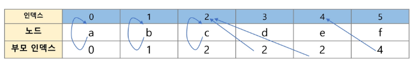
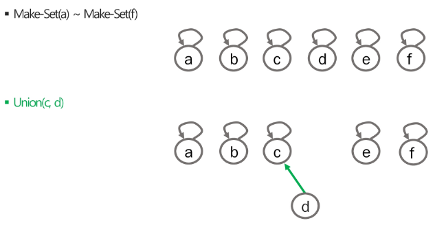
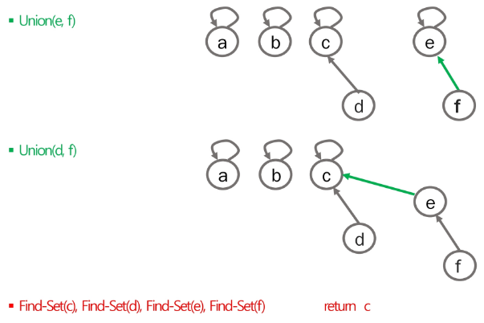
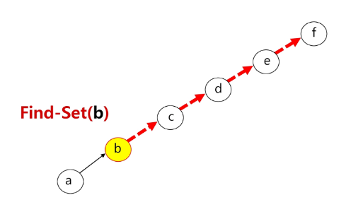
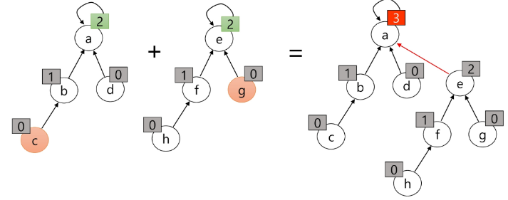
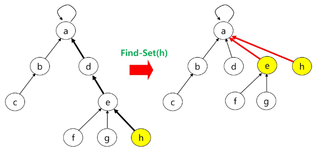

## 서로소 집합 - 기본
### 서로소 집합 (Disjoint-set, Union-Find Algorithm) 

- 서로소 또는 상호 배타 집합들은 서로 중복 포함된 원소가 없는 집합들이다. 다시 말해 **교집합이 없다.**
- 집합에 속한 하나의 특정 멤버를 통해 각 집합들을 구분한다. 이를 **대표자(representative)** 라 한다.

**서로소 집합 연산**
- **Make-Set(x)**: 처음 사전준비 (각 원소 초기화 작업) (원소가 1개인 서로소 집합들을 생성하는 것이다)
- **Find-Set(x)**: x가 속한 집합(대표자)을 찾는다.
- **Union(x, y)**: x가 속한 집합과 y가 속한 집합을 합집합 연산을 한다.
	- 고려해야할 점
		- x집합에 y집합이 흡수되는 형태인데, 어떤 대표자를 갖는 집합에 흡수시킬지는 문제를 풀 때 고려해봐야할 점이다.
		- 예: 어느 집합에 어느 집합을 흡수시키느냐에 따라서 트리의 높이가 달라질 수 있다. (대표자를 찾을 때 높이가 낮은 것이 빠른시간에 대표자를 찾을 수 있다.)

### 서로소 집합 표현

- 같은 집합의 원소들을 하나의 트리로 표현한다.
- 자식 노드가 부모 노드를 가리키며 루트 노드가 대표자가 된다.

**연산 예**





### 서로소 집합에 대한 연산

- p는 x의 부모를 저장하는 배열이다. (p\[x]는 x의 부모노드 번호이다)

**Make-Set(x)**
- 혹은 부모가 없다는 표시로 p\[x]를 -1 혹은 null로 초기화할 수도 있다.
```plain
Make-Set(x)
	p[x] <- x
```

**Find-Set(x)**
```plain
Find-Set(x)
	IF x == P[x] : RETURN x
	ELSE         : RETURN Find_Set(p[x])
```

**Union(x, y)**
```plain
Union(x, y)
	IF Find-Set(y) == Find-Set(x) RETURN;
	p[Find-Set(y)] <- Find-Set(x)
```

**구현 예시 - Java**
```java
import java.util.Arrays;

public class DisjointSet {

    static int N = 5;
    static int[] parents; // 부모 배열

    static void make() {
        for (int i = 0; i < N; i++) {
            parents[i] = i; // make-set i
        }
    }

    static int findSet(int a) {

        if (a == parents[a]) return a; // 자신이 자신의 부모라면 루트노드이고 집합의 대표자가 됨
        return findSet(parents[a]);
    }

    static boolean Union(int a, int b) {
        int aRoot = findSet(a);
        int bRoot = findSet(b);

        if (aRoot == bRoot) return false; // 두 집합의 대표자가 같으면 이미 같은 집합이므로 합집합 연산 불가
        // aRoot 에 bRoot를 흡수
        parents[bRoot] = aRoot;
        return true;
    }

    public static void main(String[] args) {
        parents = new int[N];

        // 모든 원소에 대해 단위 서로소집합 생성
        make();

        System.out.println(Arrays.toString(parents));

        Union(0, 1);
        Union(2, 3);

        System.out.println(Arrays.toString(parents));

        Union(0, 3);
        System.out.println(Arrays.toString(parents));

        System.out.println(findSet(3));

    }
}

```

## 서로소 집합 - 최적화
### 문제점

- 최악의 경우의 수 - 대표자를 찾는데 **O(H)** 가 걸린다.



### 최적화

1. **Rank(트리의 높이)를 이용한 Union**
	- 각 노드는 자신을 루트로하는 subtree의 높이를 rank로 저장한다.
	- 두 집합을 합칠 때 rank가 낮은 집합을 rank가 높은 집합에 붙인다.



2. **Path compression**
	- Find-Set을 행하는 과정에서 만나는 모든 노드들이 직접 root를 가리키도록 포인터를 바꾸어 준다.
	- 모든 경로를 압축하고 싶다면, 모든 노드에 대해서 Find-Set을 행해주면 된다.
	- 즉, 각 노드의 최상단 부모를 찾는 연산을 행하고 그 결과를 저장하는 것이다.



## Tip

:::tip
집합의 크기를 관리하고싶다면
1. 배열을 하나 더 만들어서 크기 관리  
2. **(추천)부모 배열을 처음에 -1로 초기화하고, Union할 때마다 대표자의 부모를 -1씩 늘려준다.** 그리고 크기를 구할때는 대표의 부모값의 절댓값을 구하면 된다.
:::

:::tip
집합의 개수 구하기
- 대표자의 개수를 구하면 된다!!
:::