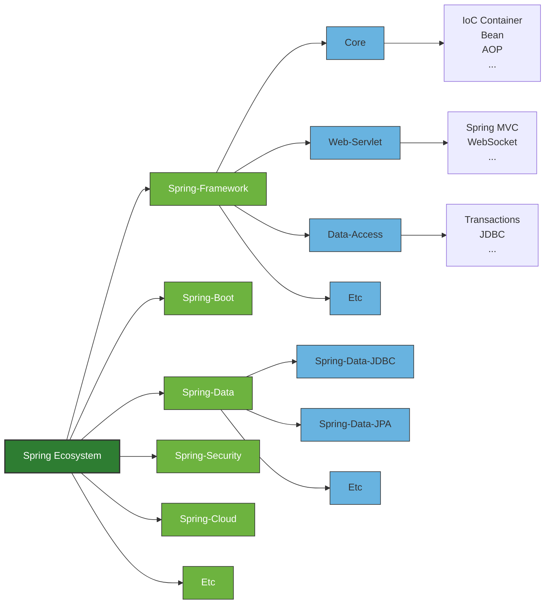

---

- 분류 기준: [https://docs.spring.io/spring-framework/reference/index.html](https://docs.spring.io/spring-framework/reference/index.html)

---

```mermaid
graph LR
    Projects[Spring Ecosystem]

    Projects --> Spring-Framework
    Projects --> Spring-Boot
    Projects --> Spring-Data
    Projects --> Spring-Security
    Projects --> Spring-Cloud
    Projects --> Etc

    Spring-Framework --> Core
    Spring-Framework --> Web-Servlet
    Spring-Framework --> Data-Access
    Spring-Framework --> Framework-Etc[Etc]

    Spring-Data --> Spring-Data-JDBC
    Spring-Data --> Spring-Data-JPA
    Spring-Data --> Data-Etc[Etc]

    Core --> CoreItems[IoC Container<br/>Bean<br/>AOP<br/>...]

    Web-Servlet --> Web-ServletItems[Spring MVC<br/>WebSocket<br/>...]

    Data-Access --> DataItems[Transactions<br/>JDBC<br/>...]

    style Projects fill:#2e7d32,stroke:#333,stroke-width:2px,color:#fff
    style Spring-Framework fill:#6db33f,stroke:#333,stroke-width:1px,color:#fff
    style Spring-Boot fill:#6db33f,stroke:#333,stroke-width:1px,color:#fff
    style Spring-Data fill:#6db33f,stroke:#333,stroke-width:1px,color:#fff
    style Spring-Security fill:#6db33f,stroke:#333,stroke-width:1px,color:#fff
    style Spring-Cloud fill:#6db33f,stroke:#333,stroke-width:1px,color:#fff
    style Etc fill:#6db33f,stroke:#333,stroke-width:1px,color:#fff
    style Core fill:#68b3e0,stroke:#333,stroke-width:1px
    style Web-Servlet fill:#68b3e0,stroke:#333,stroke-width:1px
    style Data-Access fill:#68b3e0,stroke:#333,stroke-width:1px
    style Framework-Etc fill:#68b3e0,stroke:#333,stroke-width:1px
    style Spring-Data-JDBC fill:#68b3e0,stroke:#333,stroke-width:1px
    style Spring-Data-JPA fill:#68b3e0,stroke:#333,stroke-width:1px
    style Data-Etc fill:#68b3e0,stroke:#333,stroke-width:1px
```
