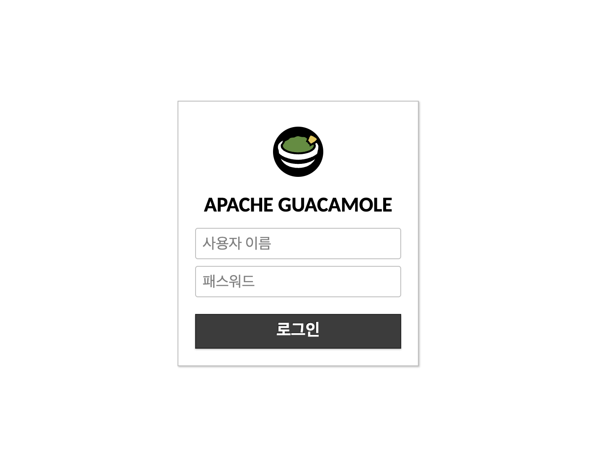
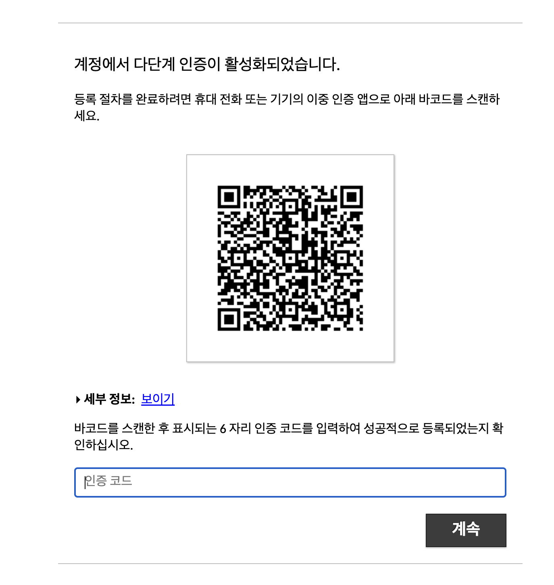
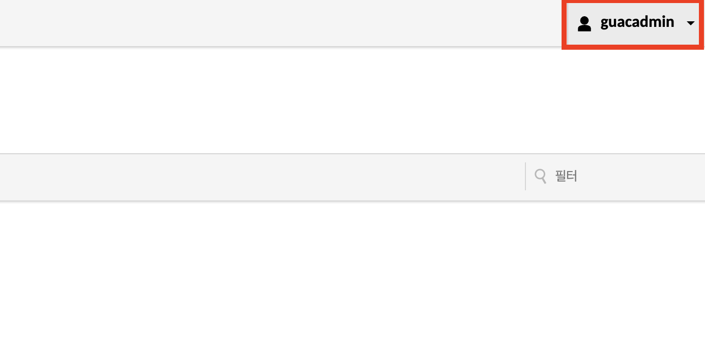
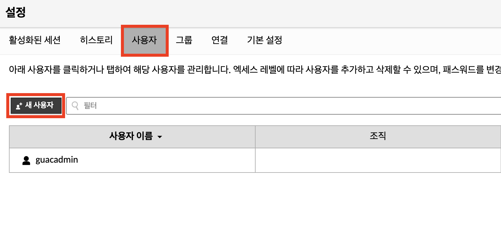
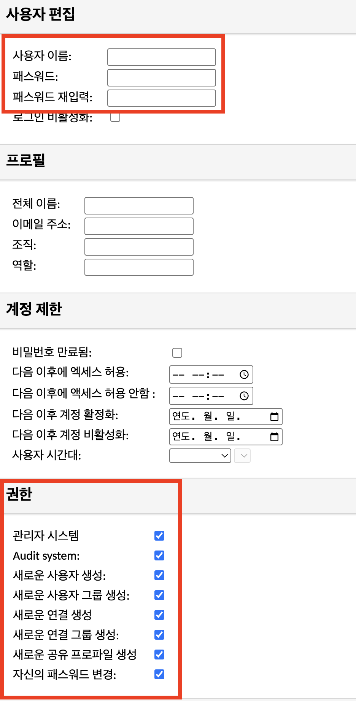
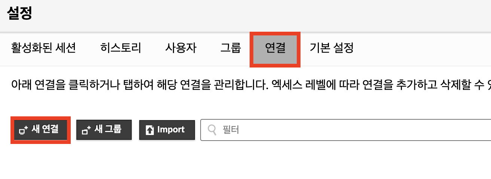
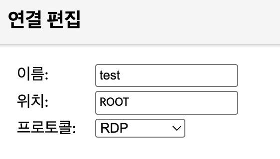
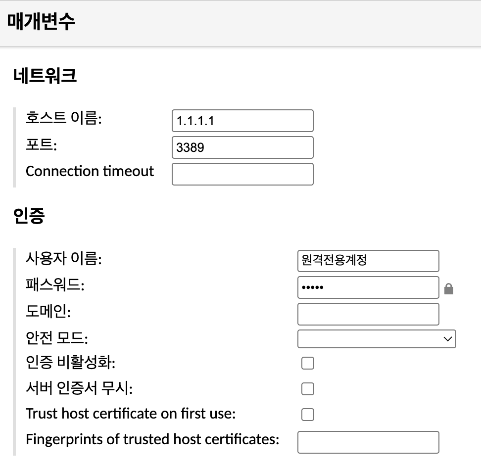
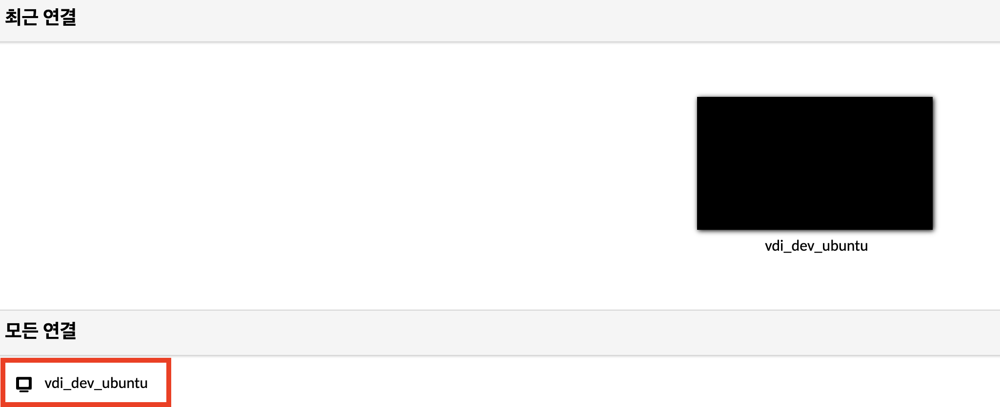

---
## 왜?

회사에서 근무할 때, 데이터 센터 내부 서버에 직접 연결을 해서 작업을 해야하는 경우 해당 망에 존재하는 VDI를 사용하였는데 현재 홈랩 환경에서도 개발용으로 우분투 VM을 VDI로 사용해보면 재밌지 않을까? 라는 생각이 들어서 진행하게되었다. (실제로 사용할지는 몰루?) 엔터프라이즈급 솔루션보다는 간단한 솔루션을 찾던 중 Apache Guacamole를 알게되었고 이를 통한 VDI 구축기를 기록하고자 한다.

## 사전 세팅 (Ubuntu)

OS: `Ubuntu 24.04.3 LTS`
- 윈도우는 이 과정이 필요없으니 바로 과카몰리 설치로 넘어가면 된다.

### RDP 서버 설치

```bash
sudo apt update
sudo apt install xrdp -y
sudo systemctl enable --now xrdp
```

- RDP 프로토콜을 이용해서 VDI를 사용하려면 RDP 서버를 설치해야한다.
- 설치하면 xrdp 서비스가 3389 포트에서 대기한다.
- `systemctl status xrdp`, `ss -tulpn | grep 3389`로 확인할 수 있다.

### 원격 전용 계정 생성 (권장)

```bash
sudo adduser 원격전용계정
sudo usermod -aG sudo 원격 전용 계정
```

- 원격 전용 계정을 생성하고 해당 계정에 관리자 권한을 준다.
- 기본 계정 로그인 세션과 충돌할 위험을 방지하기 위해 원격 전용 계정을 생성한다.

### XFCE 설치

```bash
sudo apt install xfce4 xfce4-goodies -y
```

- 우리가 아는 익숙한 우분투 GUI는 `GNOME`이다. 그러나 `GNOME`은 인터페이스는 편리하지만 무겁기도하고, `xrdp`와 호환이 안되는 경우도 있어서 `XFCE`를 설치한다.
	- `GNOME`과 `XFCE` 모두 우분투 GUI의 종류

### 세션 설정

```bash
echo "startxfce4" > /home/원격전용계정/.xsession
chown 원격전용계정:원격전용계정 /home/원격전용계정/.xsession
```

- 해당 계정으로 RDP 접속 시 `XFCE` 환경이 기본 실행되게하는 설정

### xrdp 재시작

```bash
sudo systemctl restart xrdp
```

---

## Apache Guacamole 설치

나는 쿠버네티스 클러스터에 배포했다. 만약 도커로 배포하고 싶은 경우 아래 링크를 참조하면 될 듯
- https://svrforum.com/svr/192303

### Manifest 작성

나는 쿠버네티스 클러스터에 배포했다. 만약 도커로 배포하고 싶은 경우 아래 링크를 참조하면 될 듯
- https://svrforum.com/svr/192303

**매니페스트 파일**
```yaml
apiVersion: v1
kind: Namespace
metadata:
  name: guacamole
---
apiVersion: v1
kind: Service
metadata:
  name: guacd
  namespace: guacamole
spec:
  selector:
    app: guacd
  ports:
    - protocol: TCP
      port: 4822
      targetPort: 4822
  type: ClusterIP
---
apiVersion: v1
kind: Service
metadata:
  name: postgres
  namespace: guacamole
spec:
  selector:
    app: postgres
  ports:
    - protocol: TCP
      port: 5432
      targetPort: 5432
  type: ClusterIP
---
apiVersion: v1
kind: Service
metadata:
  name: guacamole
  namespace: guacamole
spec:
  selector:
    app: guacamole
  ports:
    - protocol: TCP
      port: 80
      targetPort: 8080
  type: LoadBalancer

---

apiVersion: apps/v1
kind: Deployment
metadata:
  name: guacd
  namespace: guacamole
spec:
  replicas: 1
  selector:
    matchLabels:
      app: guacd
  template:
    metadata:
      labels:
        app: guacd
    spec:
      containers:
      - name: guacd
        image: linuxserver/guacd:latest
        volumeMounts:
        - name: drive
          mountPath: /drive
        - name: record
          mountPath: /record
      volumes:
      - name: drive
        hostPath:
          path: /guacamole/drive
      - name: record
        hostPath:
          path: /guacamole/record
---
apiVersion: apps/v1
kind: Deployment
metadata:
  name: postgres
  namespace: guacamole
spec:
  replicas: 1
  selector:
    matchLabels:
      app: postgres
  template:
    metadata:
      labels:
        app: postgres
    spec:
      containers:
      - name: postgres
        image: postgres:13.4
        env:
        - name: PGDATA
          value: /var/lib/postgresql/data/guacamole
        - name: POSTGRES_DB
          value: guacamole_db
        - name: POSTGRES_PASSWORD
          valueFrom:
            secretKeyRef:
              name: postgres-secret
              key: POSTGRES_PASSWORD
        - name: POSTGRES_USER
          valueFrom:
            secretKeyRef:
              name: postgres-secret
              key: POSTGRES_USER
        volumeMounts:
        - name: init
          mountPath: /docker-entrypoint-initdb.d
        - name: data
          mountPath: /var/lib/postgresql/data
      volumes:
      - name: init
        hostPath:
          path: /guacamole/init
      - name: data
        hostPath:
          path: /guacamole/data
---
apiVersion: apps/v1
kind: Deployment
metadata:
  name: guacamole
  namespace: guacamole
spec:
  replicas: 1
  selector:
    matchLabels:
      app: guacamole
  template:
    metadata:
      labels:
        app: guacamole
    spec:
      containers:
      - name: guacamole
        image: jwetzell/guacamole:arm64
        env:
        - name: EXTENSIONS
          value: auth-totp
        - name: GUACD_HOSTNAME
          value: guacd
        - name: POSTGRES_DATABASE
          value: guacamole_db
        - name: POSTGRES_HOSTNAME
          value: postgres
        - name: POSTGRES_PASSWORD
          valueFrom:
            secretKeyRef:
              name: postgres-secret
              key: POSTGRES_PASSWORD
        - name: POSTGRES_USER
          valueFrom:
            secretKeyRef:
              name: postgres-secret
              key: POSTGRES_USER
        - name: POSTGRESQL_AUTO_CREATE_ACCOUNTS
          value: "true"
        volumeMounts:
        - name: drive
          mountPath: /drive
      volumes:
      - name: drive
        hostPath:
          path: /guacamole/drive
---
apiVersion: v1
kind: Secret
metadata:
  name: postgres-secret
  namespace: guacamole
type: Opaque
data:
  POSTGRES_USER: Z3VhY2Ftb2xl
  POSTGRES_PASSWORD: Z3VhY2Ftb2xl
```

- 매니페스트 출처: https://oopflow.medium.com/how-to-install-guacamole-on-kubernetes-7d747438c141
- arm 아키텍처가 아닌 경우 `image: jwetzell/guacamole:arm64`를 `image: jwetzell/guacamole:latest` 로 바꾸어주면된다.
- 나는 `guacamole` 서비스의 서비스 타입을 `LoadBalancer`에서 `NodePort`로 바꾸어 주었고, `postgres`의 비밀번호를 바꾸어주었다.
- 설정이 워낙 쉽고, VDI를 여러 개를 사용할 것 같지는 않아서 PV는 연결하지 않았다.

### 설치

```bash
kubectl create namespace guacamole
kubectl apply -f 매니페스트파일.yml -n guacamole
```

- 네임스페이스를 따로 생성한다.
- 작성한 매니페스트 파일을 적용하여 배포한다.

---

## Apache Guacamole 설정
### 로그인



- guacamole 서비스가 클러스터에 떠있는 경로로 접속하면 위와 같은 로그인 화면이 뜬다.
	- Docker로 설치한 경우 https://ip:8443
- 초기 id, pw를 입력하고 로그인한다.
	- id: guacadmin
	- pw: guacadmin



- Google Authenticator 등으로 2FA 인증 등록을 한다.
	- Docker 버전의 경우 2FA가 기본으로 되어있지 않다. (개인적으로 특정 VM에 직접 접근하는 것이므로 외부에 노출할 경우 2FA 인증 설정을 하는 것을 권장한다)

### 새로운 계정 생성 & 기본 계정 삭제



- 우측 상단 계정 클릭 > 세팅



- 사용자 > 새 사용자



- 새롭게 사용할 계정의 id 와 pw를 입력하고 기본 계정을 지우고 이 계정을 admin으로 사용할 것이기 때문에 모든 권한을 체크해준다.
- 계정 생성 이후 현재 기본 계정을 로그아웃한다.
- 새로운 계정 로그인 후 기본 계정을 삭제한다.

### 연결 생성



- 우측 상단 계정 클릭 > 세팅
- 연결 > 새 연결




- 정말 많은 설정이 있지만 필수적으로 해야할 세팅을 하고 나머지 세팅은 추후 용도에 맞게 설정하자.
	- 연결 편집
		- 이름: 사용할 연결 이름
		- 위치: 그대로 놔두기
		- 프로토콜: `RDP`로 변경
	- 매개 변수
		- 네트워크
			- 호스트 이름: 접속할 호스트의 IP
			- 포트: `3389` (RDP 포트)
		- 인증
			- 사용자 이름: 생성했던 원격 전용 계정 (계정을 생성하지 않았다면, 원래 접속하던 기본 계정)
			- 패스워드: 계정의 패스워드
- 세팅 이후 저장

### 연결



- 우측 상단 계정 클릭 > 홈
- 생성한 연결 클릭


- 연결 성공!
- 이후 세부 설정 세팅 후 사용하면 된다.
