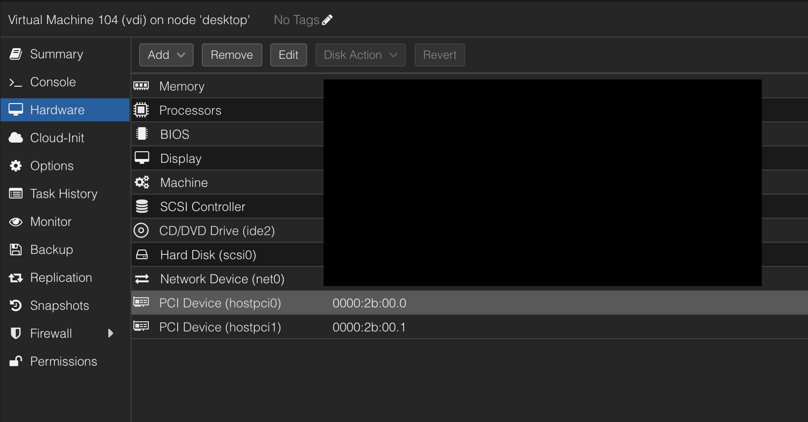

---
## 왜?

GPU Passthrough란 VM에 직접 GPU장비를 할당하는 기술이다. 이를 활용하여 VM을 사용할 때, GPU를 VM에 직접 할당시켜서 AI추론 등에 활용하고 싶었다. 

cf) GPU Passthrough를 할당한 Window VM으로 게임도 원활하게 가능하지만, 온라인 게임에서는 뱅가드와 같은 안티치트 프로그램이 커널 단계에서 작동하기 때문에 온라인 게임을 주로 하는 나에게는 해당 사항이 없었다.

---
## 사전 준비
### 바이오스

- 바이오스에서 `SVM`과 `IOMMU`를 켜주어야한다.
- 보통 기본적으로 켜져있지만, 켜져있지 않은 경우 바이오스에 접속해서 켜주도록 한다.

### GPU 장치 ID, PCI ID 확인

**NVIDIA GPU 기준**

```bash
lspci -nn | grep -i nvidia

# 출력예시
2b:00.0 VGA compatible controller [0300]: NVIDIA Corporation AD103 [GeForce RTX 4080] [10de:2704] (rev a1)
2b:00.1 Audio device [0403]: NVIDIA Corporation Device [10de:22bb] (rev a1)
```

- 위 명령어를 입력하면 아래와 같은 출력이 나올 것이다.
- 여기서 GPU 장치 ID / 오디오 장치 ID를 기록해두자. 
	- 출력 예시로 보면, GPU 장치 ID: `10de:2704` / 오디오 장치 ID: `10de:22bb`
- 추가적으로 PCI ID도 기록해주자.
	- 출력 예시로 보면, GPU 장치 PCI ID: `2b:00.0` / 오디오 장치 PCI ID: `2b:00.1`

---
## Proxmox
### 콘솔

**Proxmox에서 IOMMU 활성화**

```bash
nano /etc/default/grub
```

```
# Intel CPU
GRUB_CMDLINE_LINUX_DEFAULT="quiet intel_iommu=on iommu=pt"

# AMD CPU
GRUB_CMDLINE_LINUX_DEFAULT="quiet amd_iommu=on iommu=pt"
```

- `/etc/default/grub` 파일에서 `GRUB_CMDLINE_LINUX_DEFAULT` 항목을 찾아 CPU 제조사에 맞게 변경해주자.

```bash
update-grub
reboot
```

- 설정을 적용하고 재부팅

**GPU 장치 등록**

```
echo "options vfio-pci ids=GPU장치ID,오디오장치ID" > /etc/modprobe.d/vfio.conf
```

- 앞서 확인했던 GPU장치ID, 오디오장치ID를 등록시켜준다.

```bash
update-initramfs -u -k all
reboot
```

- initramfs 업데이트 후 재부팅

---
### VM에 GPU 연결



- Proxmox 콘솔에 들어간 후 GPU를 장착할 VM 선택
- Hardware - Add - PCI Device
	- Raw device 선택
	- 앞서 기록해 두었던 GPU PCI ID, 오디오 PCI ID를 추가한다.
- 재부팅

---
## GPU 드라이버 설치

VM에서 GPU를 인식하기 위해 GPU 드라이버를 설치해야한다. 

**Ubuntu 기준**

```bash
sudo add-apt-repository ppa:graphics-drivers/ppa -y
sudo apt update
```

- 최신 드라이버를 받기 위한 공식 레포지토리를 추가한다.

```bash
ubuntu-drivers devices

# 출력 예시
== /sys/devices/... ==
model    : NVIDIA GeForce RTX 4080
driver   : nvidia-driver-550 - distro non-free recommended
driver   : nvidia-driver-535 - distro non-free
```

- 설치 가능한 드라이버를 확인한다.

```bash
sudo apt install nvidia-driver-550
```

- 위 출력이 나왔을 때 `recommended`가 붙어있는 드라이버를 설치한다. (필수는 아니지만 가장 안정적인 버전)

```
reboot
```

- 재부팅을 한다.

```bash
nvidia-smi

# 출력예시
+-----------------------------------------------------------------------------+
| NVIDIA-SMI 550.78       Driver Version: 550.78       CUDA Version: 12.4     |
| GPU Name  : NVIDIA GeForce RTX 4080                                       |
| Fan Temp Perf Pwr:Usage/Cap Memory-Usage ...
+-----------------------------------------------------------------------------+
```

- `nvidia-smi`를 입력했을 때 출력이 뜨면 성공

---
## 레퍼런스

- https://phum.co.kr/tech-74/