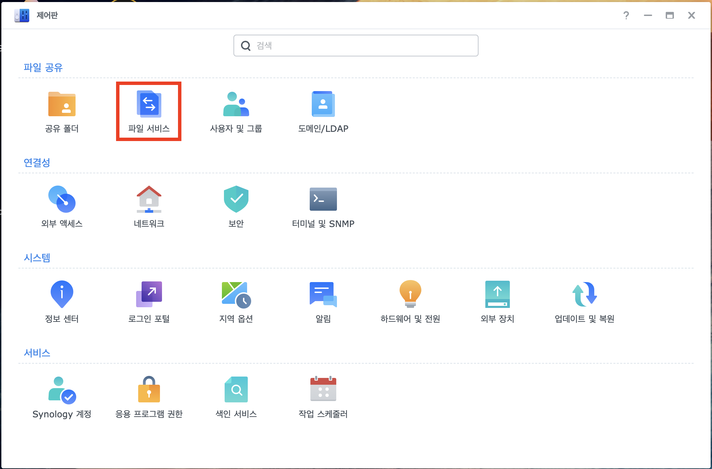
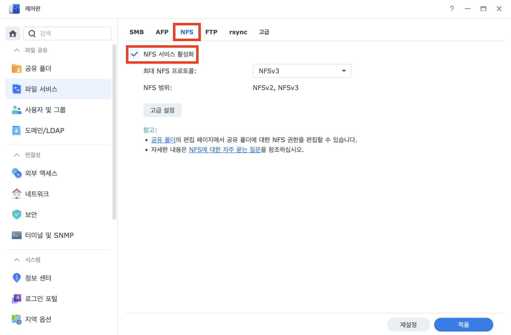
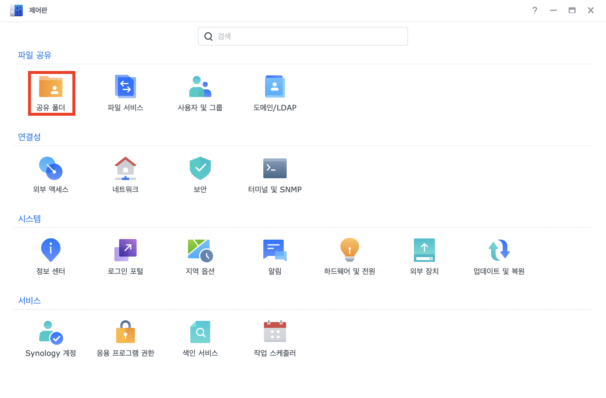
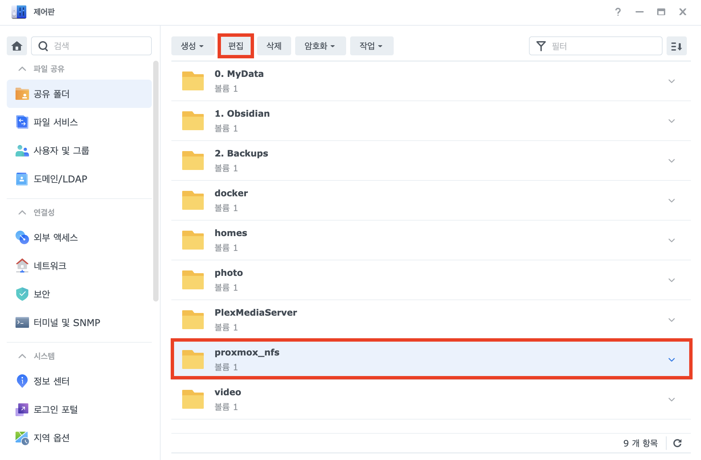
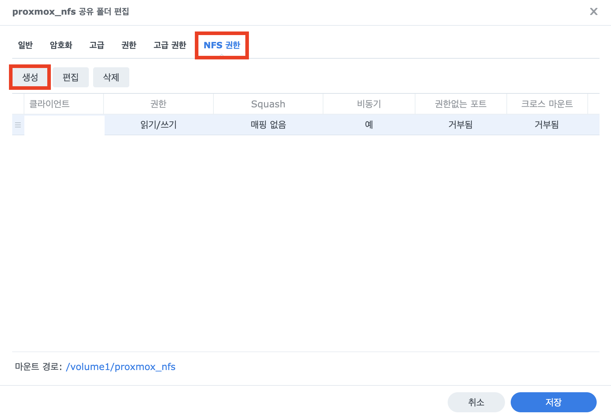
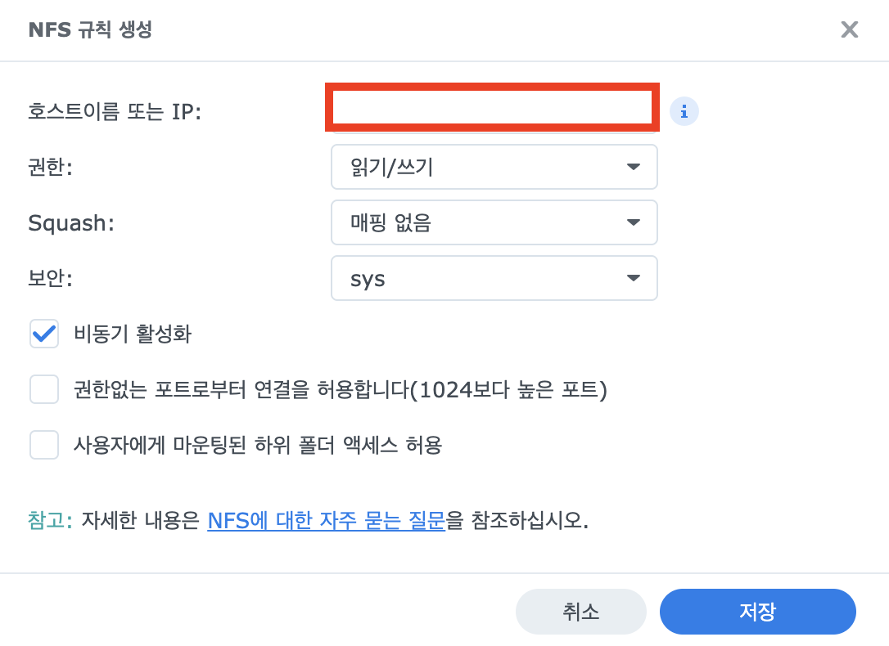
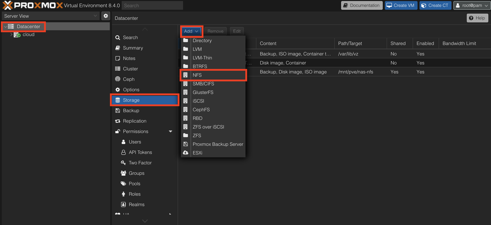
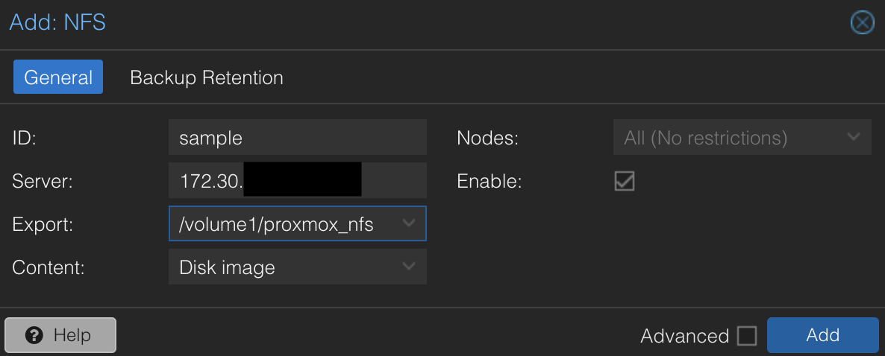
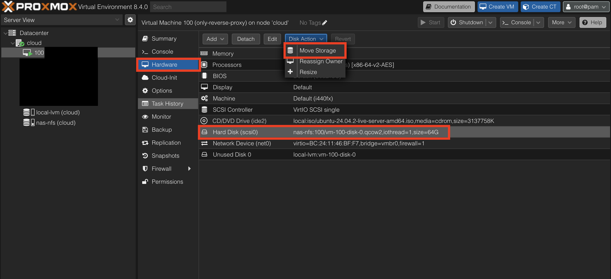
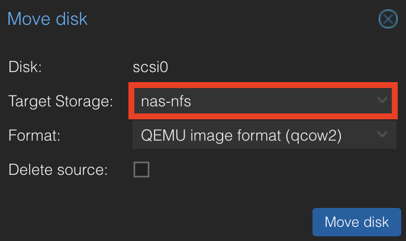

---

## 왜?

데이터 센터에서 근무를 할 때를 생각해보면, 데이터 센터에서는 컴퓨팅 자원(서버 노드: vCPU, vRAM 제공)과 스토리지 자원(NAS 스토리지 서버)이 분리되서 운영되었다. VM의 볼륨은 NAS 스토리지에 위치시키고 이를 NFS 프로토콜을 통해 각 서버 노드에서 마운트하여 사용한다. 왜냐하면 어떠한 하나의 서버 노드가 폴트가 발생했을 때 VM 볼륨이 독립된 NAS 스토리지에 존재하기 때문에 다른 정상 동작 중인 서버 노드에서 해당 VM을 재구동할 수 있기 때문이다.

그런데 지금 나의 홈랩 환경에서는 VM 백업은 주기적으로 스케줄링 되어있지만, 각 VM들의 볼륨은 로컬 블록 스토리지에 존재한다.

사실 뭐,, 그렇게 중요한 서비스가 돌아가는 것도 아니고 이러한 가용성 보장이 필요하냐? 라는 차원에서는 굳이? 싶지만, 홈랩 자체가 재미로하는 취미생활이니까,, 그래서 구동하고 있는 VM들의 볼륨을 Synology NAS에 위치시키는 작업을 해보았다.

---

## Synology NAS 설정

### 시놀로지 나스에서 NFS 활성화

- DSM에서 제어판 > 파일 서비스로 이동

- NFS 탭 선택
- NFS 서비스 활성화
  - 최대 NFS 프로토콜은 원하는 프로토콜 선택

### 공유 폴더 NFS 설정

- 제어판 > 공유 폴더 이동

- VM 볼륨으로 사용하고자하는 공유 폴더 선택 > 편집

- NFS 권한 > 생성

- 호스트이름 또는 IP
  - proxmox 호스트의 IP 입력
  - 나는 여러 proxmox 노드가 접근할 수 있어야할 수 있기 때문에 CIDR 입력했다.

---

## Proxmox 설정

- Datacenter > Storage > Add > NFS

- `ID`: 원하는 이름
- `Server`: 나스 서버 ip
- `Export`: 이전에 NFS 규칙 설정을 잘 했다면 해당 볼륨이 목록에 뜸
- `Content`: VM 볼륨을 위해서라면 Disk image 선택 (다른 필요한 옵션이 있다면, 선택)
- Add 클릭하면 NFS 스토리지가 추가된다.

---

## VM 볼륨 이동

- 볼륨 이동을 원하는 VM 선택 > Hardware > Hard Disk > Disk Action > Move Storage

- Target Storage: 만들었던 NFS 스토리지를 선택 > Move disk

이러한 과정을 거치면 NAS 공유 폴더를 VM들의 볼륨으로 사용하는 과정이 완료된다.
나는 추가적으로 해당 NAS 공유 폴더에 주기적인 백업 스케줄링도 걸었다. 이렇게 하면 하나의 노드에서 폴트가 나더라도 VM을 즉시 재기동 할 수 있게 된다.
