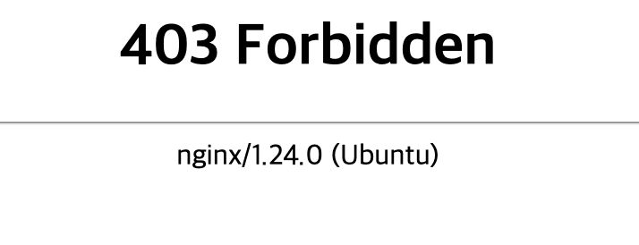
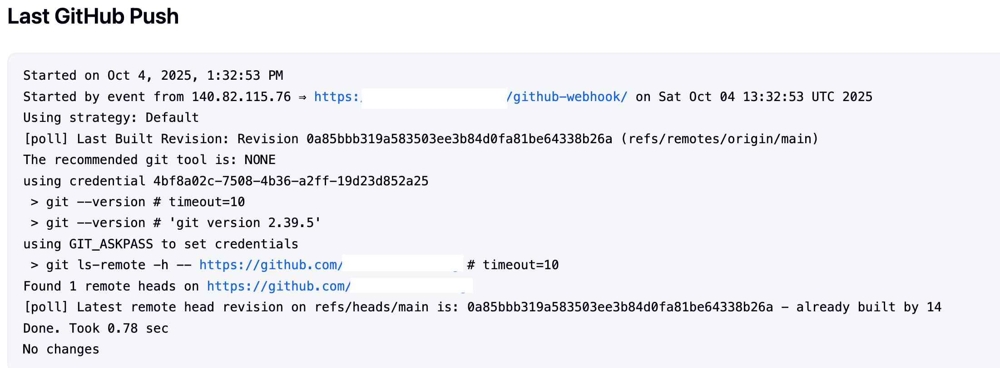

---
## 왜?

개인적으로 개발한 것들을 배포할 때 Github에 푸시하면 Github에서 웹훅을 Jenkins로 보내고 Jenkins가 CI/CD 파이프라인을 실행하게끔 세팅했었다. 이러한 웹훅을 보내기 위해서 Jenkins를 어쩔 수 없이 리버스프록시를 통해서 외부에 노출시켰었는데 이렇게 외부로 노출시키는게 항상 찝찝했었다. 그러다가 문득 Github에서 웹훅을 보내는 경로와 ip만 화이트리스트로 등록하면 되다는 생각이 들었고 이를 진행하게 되었다.

---
## 기존 Nginx 설정

```nginx
server {
    listen 443 ssl;
    server_name 젠킨스도메인;

    # SSL 인증서 설정
    ssl_certificate 풀체인키경로;
    ssl_certificate_key 개인키경로;

    .. 기타 설정들

    location / {
        proxy_pass 내부젠킨스주소;
        .. 기타 프록시 헤더 설정들
    }
}
```

- 해당 젠킨스 도메인으로 들어오는 모든 요청을 받는다.
- 물론 젠킨스에 로그인을 해야하고, 2FA를 걸 수도 있지만 애초에 외부에 노출시키지 않는 것이 가장 안전하다.

---
## 변경한 Nginx 설정

```nginx
server {
    listen 443 ssl;
    server_name 젠킨스도메인;

    # SSL 인증서 설정
    ssl_certificate 풀체인키경로;
    ssl_certificate_key 개인키경로;

    .. 기타 설정들

    location /github-webhook/ {
        proxy_pass 내부젠킨스주소;
        .. 기타 프록시 헤더 설정들

        # Github 웹훅 화이트리스트
        allow 192.30.252.0/22;
        allow 185.199.108.0/22;
        allow 140.82.112.0/20;
        deny all;
    }

    location / {
        deny all;
    }
}
```

- `/github-webhook/` 경로로 웹훅이 날아온다. 따라서 `/github-webhook/` 경로 이며(AND) Github가 웹훅을 보내는 IP일 경우에만 허용하면 된다.
	- Github 웹훅 IP: https://api.github.com/meta
- 나머지 경로는 무조건 다 차단한다.
- `location /` 가 `location /github-webhook/` 보다 위에 있어도 상관없다. 왜냐하면, Nginx는 접두사(location prefix)가 더 구체적인 것을 우선한다.
	- 하지만, '나머지는 모두 차단' 이라는 의미를 명확하게 보이게 하기 위해서 아래에 두었다.

```bash
sudo systemctl restart nginx
```

- Nginx 설정을 바꾼 후 위 명령어로 nginx를 재실행하면 적용된다.
	- 위 명령어를 치기 전에 혹시나 오타가 있을 수 있으니 `nginx -t`로 문법에 틀린 부분이 없는지 검사하는 것도 좋다.

---

## 결과



- 기존 주소로 접근하면 이렇게 차단되는 것을 알 수 있다.



- 그리고 웹훅을 보내보면 웹훅은 기존 주소로 잘 오는 것을 알 수 있다.