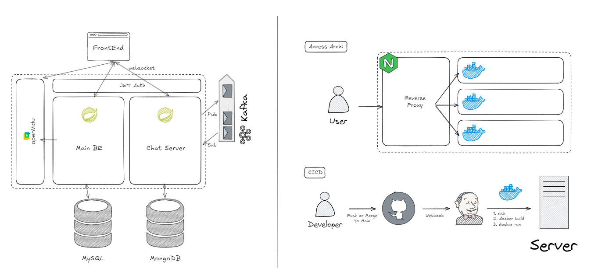
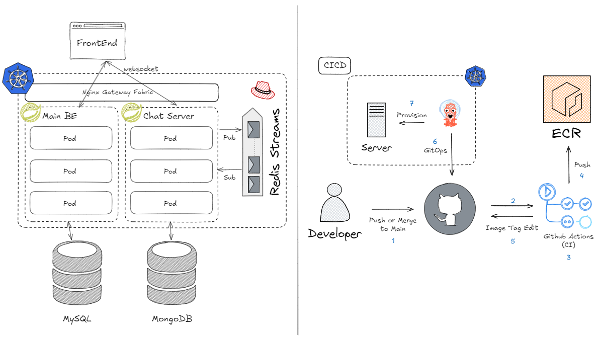

# About  
---  
Server, DevOps, Cloud 분야를 지속적으로 학습하고있으며, 기존 시스템의 문제점을 파악하고 개선하는 것을 좋아합니다.  
  
- **Github**: https://github.com/Son-Hunseo  
- **Email**: 2423aa@naver.com  
  
---  
## 💼 경력  
  
한화시스템 (2026.07.01 ~ 2026.08.31) - Cloud 사업팀 인턴
- MSP 업무 보조 (AWS Bedrock, Azure OpenAI 권한 부여 업무 자동화)  
- Private Cloud 업무 보조 (신규 GPU 장비 모니터링 솔루션 PoC)  
  
---  
## 📜 자격증  
  
| 자격증명 | 취득일 | 만료일 |
|---------|--------|--------|
| CKA (Certified Kubernetes Administrator) | 2026.01 | 2028.01 |
| AWS Certified Cloud Practitioner | 2025.03 | 2028.03 |
  
---  
## 🛠 기술  
### Strong  
  
- `Java` / `Spring`
- `Docker` / `Kubernetes` (CKA)  
  
### Available  
  
- `Jenkins` / `Github Action` / `ArgoCD`  
- `AWS` (AWS Certified Cloud Practitioner)  
- `Azure`  
- `GCP`  
- `Python` / `FastAPI` / `Flask`  
- `DataDog`  
- `LangChain` (AI 활용 해커톤 수상 3회)  
  
---  
## 프로젝트 - 익명 편지 서비스  
  
---  
### V1 (팀원 6명 / 2025. 01)  
  

#### 프로젝트 개요

- 선물함 링크를 공유하고 해당 링크로 본인의 지인들이 익명으로 편지를 작성해주는 익명 편지 서비스 (유저 약 400명, 특이사항: 채팅, 영상통화 기능)
- **Github**: https://github.com/Son-Hunseo/chocoletter  
  
#### 담당

- Main BE API 구축 - `Java`, `Spring`
- 인프라 환경 구축, CICD 파이프라인 구축 - `Docker`, `Jenkins`
  
  
---  
### ⭐V2 - 고도화 (개인 프로젝트 / 2026.01)  
  
  

#### 프로젝트 개요

- 기존 익명 채팅 프로젝트를 고도화하는 개인 프로젝트
- **Github**: https://github.com/Son-Hunseo/chocoletter-refac  
  
#### 서비스 링크

- 발렌타인데이 이전 환경 - https://chocoletter.sonhs.com (편지 전송, 편지 일부 확인)  
- 발렌타인데이 이후 환경 - https://chocoletter.sonhs.com (편지 전체 확인, 채팅 기능)  
  
#### 고도화 이력

| 번호  | 개선 내용                         | 주요 사유                                                                               | 블로그 기록                                                                                 |
| --- | ----------------------------- | ----------------------------------------------------------------------------------- | -------------------------------------------------------------------------------------- |
| 1   | 쿠버네티스 환경으로 마이그레이션             | Auto Healing, Auto Scaling, 배포 이력 관리, 롤백 등의 이유                                      | [쿠버네티스 환경으로 마이그레이션](https://blog.sonhs.com/Project/Chocoletter-Advance-01)             |
| 2   | Kafka에서 Redis Streams로 마이그레이션 | 1:1 채팅 목적에서 Kafka는 오버엔지니어링이라고 판단, 핵심 요구사항을 모두 만족하면서 운영 측면에서 더 가벼운 Redis Streams로 전환 | [Kafka에서 Redis Streams로 마이그레이션](https://blog.sonhs.com/Project/Chocoletter-Advance-02) |
| 3   | 잘못된 암호화 기능 수정                 | 잘못 설계된 암호화 로직 수정                                                                    | [잘못된 편지 내용 암호화 기능 수정](https://blog.sonhs.com/Project/Chocoletter-Advance-03)           |
| 4   | 영상통화 기능 삭제                    | 저조한 사용률, 기능 사용률과 중요도에 비해 과한 운영, 자원적 리소스 소모                                          | [영상통화 기능 삭제](https://blog.sonhs.com/Project/Chocoletter-Advance-04)                    |

---  
## 🏆 수상이력  
  
| 대회명                      | 프로젝트 내용                 | 수상일        | 수상 내역 | 주최 기관      |
| ------------------------ | ----------------------- | ---------- | ----- | ---------- |
| 서울 생성형 AI 해커톤            | 시니어를 위한 AI 에듀테크 앱 개발    | 2023.07.12 | 우수상   | 서울디지털재단    |
| 경기도 GenAI 공공데이터 창업 경진 대회 | 전세사기 방지 RAG 챗봇 서비스 개발   | 2023.08.01 | 우수상   | 경기도경제과학진흥원 |
| 메타버스 AI 콘텐츠 페스티벌         | 아이를 위한 AI 동화책 생성 서비스 개발 | 2023.11.14 | 우수상   | 문화체육관광부    |
